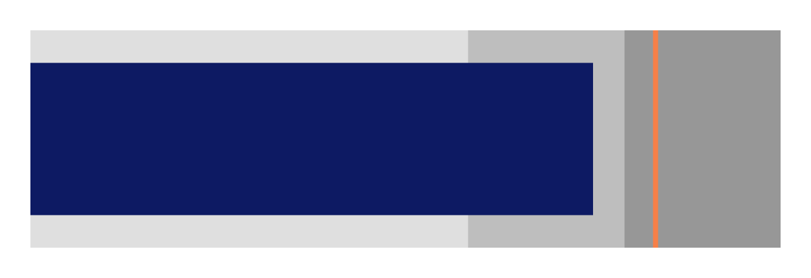
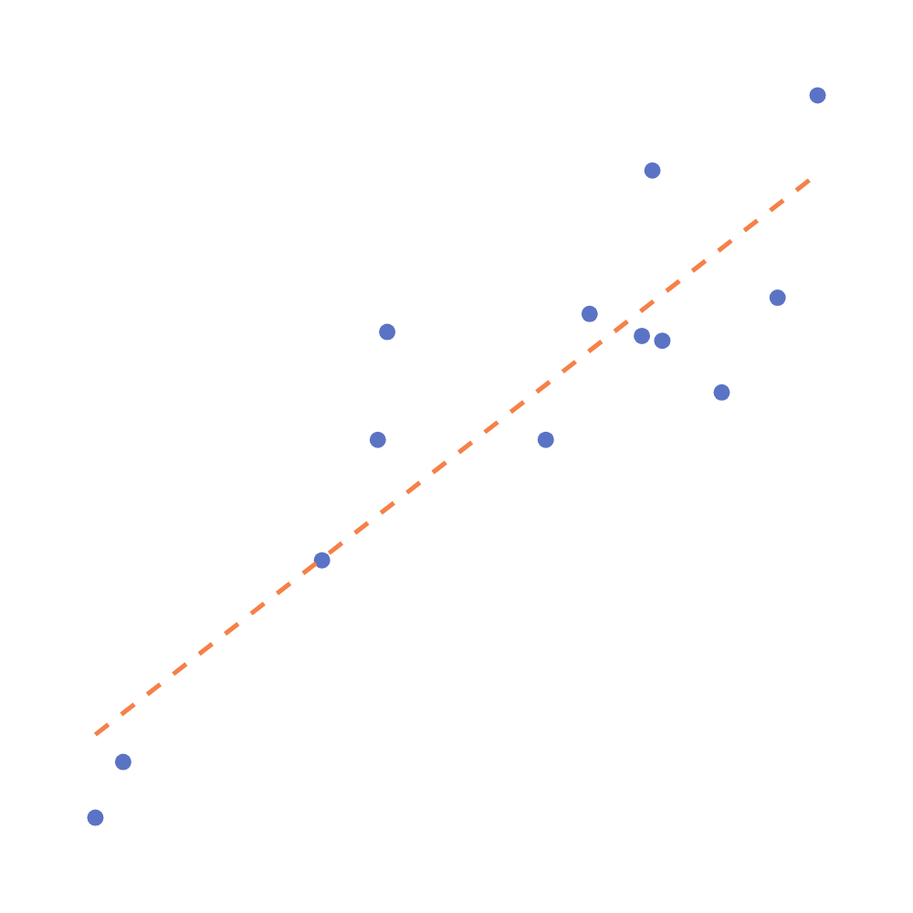
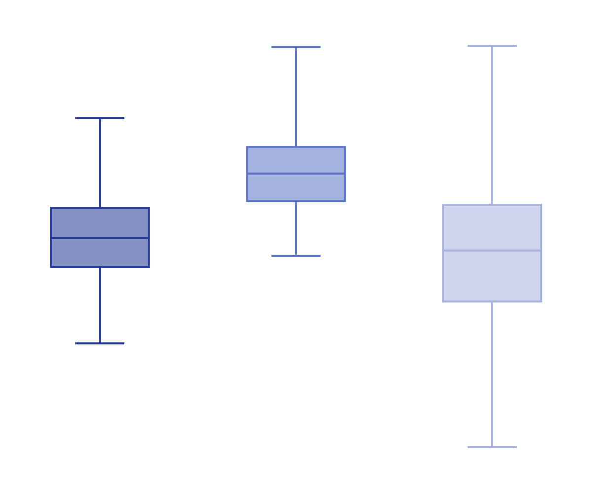

<!-- _class: title -->

# Data Visualisation
## Day 1 — From Data to Insight

---

**Course Introduction · Data Fundamentals · Tools · Data Types**

*9-week programme · Excel · Google Sheets · Python*

---

## Agenda — Day 1

<div class="cols">

<div>

**Morning**
1. Data → Information → Insight
2. Why visualisation matters
3. The visualisation workflow
4. Our three tools

</div>

<div>

**Afternoon**
5. Data types — the full picture
6. Which data type → which chart?
7. Hands-on exercise
8. Q & A + homework

</div>

</div>

<br>

> By end of day you will understand **what data is**, **what it becomes**, and **how we work with it** for the rest of this course.

---

<!-- _class: divider -->

<span class="part-no">01</span>

# What Is Data?

## And Why Does It Matter?


---

## Data · Information · Insight

<div class="cols-1-2">
<div style="margin-right: px;">

A single transaction:


</div>
<div>

Table record each transaction:

<div class="small-table">

| Date       | Invoice | Customer       | Product     | Qty | Unit Price | Total   |
|------------|---------|----------------|-------------|-----|------------|---------|
| 2024-01-03 | INV-001 | Alice Johnson  | Laptop X1   |   1 |     $899   |   $899  |
| 2024-02-14 | INV-002 | Bob Martinez   | Mouse Pro   |   3 |     $120   |   $360  |
| 2024-03-07 | INV-003 | Carol White    | Laptop X1   |   1 |     $899   |   $899  |
| 2024-01-22 | INV-004 | David Lee      | Keyboard K2 |   2 |     $150   |   $300  |
| 2024-04-11 | INV-005 | Emma Brown     | Monitor 27" |   1 |     $450   |   $450  |
| 2024-05-03 | INV-006 | Frank Wilson   | Mouse Pro   |   2 |     $120   |   $240  |
| 2024-02-28 | INV-007 | Grace Taylor   | Laptop X1   |   1 |     $899   |   $899  |
| 2024-06-15 | INV-008 | Henry Clark    | Monitor 27" |   2 |     $450   |   $900  |
| 2024-03-19 | INV-009 | Irene Scott    | Keyboard K2 |   1 |     $150   |   $150  |
| 2024-05-27 | INV-010 | James Rivera   | Mouse Pro   |   5 |     $120   |   $600  |
|...|

</div>

</div>

</div>


---

## Data · Information · Insight

<div class="cols-2-1">
<div>
Table record each transaction:
<div class="small-table">

| Date       | Invoice | Customer       | Product     | Qty | Unit Price | Total   |
|------------|---------|----------------|-------------|-----|------------|---------|
| 2024-01-03 | INV-001 | Alice Johnson  | Laptop X1   |   1 |     $899   |   $899  |
| 2024-02-14 | INV-002 | Bob Martinez   | Mouse Pro   |   3 |     $120   |   $360  |
| 2024-03-07 | INV-003 | Carol White    | Laptop X1   |   1 |     $899   |   $899  |
| 2024-01-22 | INV-004 | David Lee      | Keyboard K2 |   2 |     $150   |   $300  |
| 2024-04-11 | INV-005 | Emma Brown     | Monitor 27" |   1 |     $450   |   $450  |
| 2024-05-03 | INV-006 | Frank Wilson   | Mouse Pro   |   2 |     $120   |   $240  |
| 2024-02-28 | INV-007 | Grace Taylor   | Laptop X1   |   1 |     $899   |   $899  |
| 2024-06-15 | INV-008 | Henry Clark    | Monitor 27" |   2 |     $450   |   $900  |
| 2024-03-19 | INV-009 | Irene Scott    | Keyboard K2 |   1 |     $150   |   $150  |
| 2024-05-27 | INV-010 | James Rivera   | Mouse Pro   |   5 |     $120   |   $600  |
| ... |

</div>

</div>
  
<div>

Sum of transactions by month:

| Month | Revenue |
|---|---|
| Jan | 42 |
| Feb | 55 |
| Mar | 48 |
| Apr | 62 |
| May | 78 |
| Jun | 85 |

</div>
</div>

---

## Data · Information · Insight

<div class="cols3">

<div class="card">

### 📥 Data
Raw, unprocessed facts — no context, no meaning.

<br>

`42, 87, 13, 56`

`2024-01-03, North, 5000`

</div>

<div class="card mid">

### 📊 Information
Data **with context** — structured, labelled, comparable.

<br>

*"Monthly revenue Jan–Apr: 42k, 87k, 13k, 56k USD"*

</div>

<div class="card warm">

### 💡 Insight
Information that drives **action** — the "so what?" answer.

<br>

*"Revenue collapsed in March — investigate supply chain."*

</div>

</div>

<br>

> **Visualisation is the bridge** that turns information into insight at a glance.

---

## Why Visualisation Matters

<div class="cols">

<div>

**Without a chart** — find the biggest monthly jump:

| Month | Revenue |
|---|---|
| Jan | 42 |
| Feb | 55 |
| Mar | 48 |
| Apr | 62 |
| May | 78 |
| Jun | 85 |

*How long did that take?*

</div>

<div>

**With a line chart** — answer in under a second:


```

*Apr → May (+16k) is the biggest jump.*

```

</div>

</div>
---

## The Same Numbers — Three Levels

| Level | What you see | What you can do |
|---|---|---|
| **Data** | `42, 55, 48, 62, 78, 85, 92, 88, 95, 102, 98, 115` | Nothing yet |
| **Information** | Monthly revenue Jan–Dec (USD thousands) | Begin comparing |
| **Insight** | Revenue grew 174% over the year; Q3 was the inflection point | Make a decision |

<br>

<div class="box">

**The analyst's job:** move every stakeholder from the left column to the right column — as fast as possible.

</div>

---


## The Visualisation Workflow

Every session in this course follows the same pipeline:

<br>

<div class="box-navy">

```
Raw Data  ▶  Clean & Structure  ▶  Presentation Table  ▶  Chart / Dashboard  ▶  Story + Decision                 
```

</div>

<br>

We cover **every step** — not just the chart at the end.
The table step is where most analysts lose quality.

---

## Ex01.01

<div class="box-navy" style="width: 100%;">

```
Raw Data ▶ Clean & Structure ▶ Presentation Table 
```
*Ronnykym. (2020). Online Store Sales Data [Data set]. Kaggle.*

Use Excel formulas or pivot table to report on sale by month of the year 2019 and 2020.

</div>


---
## Ex01.01


<!-- estimation 15 minute -->

---

<!-- _class: divider -->

<span class="part-no">02</span>

# Our Tools

## Excel · Google Sheets · Python

---


## Three Tools, One Workflow

<div class="cols3">

<div class="card">

### Microsoft Excel

- Business reports
- Quick prototypes
- PivotTables
- One-off analysis

<br>

Insert → **Charts wizard**

</div>

<div class="card">

### Google Sheets

- Shared dashboards
- Live data feeds
- Team collaboration
- Cloud access

<br>

Insert → **Chart panel**

</div>

<div class="card warm">

### Python 🐍

- Large datasets
- Automation & scripts
- Publication quality
- Reproducible analysis

`matplotlib` `seaborn` `plotly`

</div>

</div>

<br>

*Knowing **which tool to reach for** is itself a professional skill.*

---

## Excel — Core Skills We Will Cover

<div class="cols">

<div>

**Data work**
- PivotTable — group, aggregate, pivot
- VLOOKUP / XLOOKUP — merge tables
- Conditional formatting
- Data validation

<br>

**Charts**
Line · Bar · Pie · Waterfall
Funnel · Stock (Candlestick) · Combo

</div>

<div>


</div>

</div>

---

## Google Sheets — When to Choose It

<div class="cols">

<div>

**Strengths over Excel**

- Real-time multi-user editing
- Built-in `QUERY()` — SQL-like filtering
- `IMPORTRANGE()` — live data from another sheet
- Free, browser-based, easy sharing
- Native connection to Google Data Studio

</div>

<div>

| Situation | Choose |
|---|---|
| Colleagues editing simultaneously | **Sheets** |
| Data stays on your machine | **Excel** |
| Pulling live web / API data | **Sheets** |
| Complex macros / VBA | **Excel** |
| Sharing with non-Office users | **Sheets** |
| Large files (> 100MB) | **Excel** |

</div>

</div>

---

## Python — Three Libraries, Three Purposes

<div class="cols3">

<div class="card">

### matplotlib

The **foundation**. Full manual control over every element.

```python
import matplotlib.pyplot as plt

plt.plot(months, revenue,
         color='#0D1A63')
plt.title('Monthly Revenue')
plt.show()
```

</div>

<div class="card mid">

### seaborn

**Statistical charts** with minimal code. Built on matplotlib.

```python
import seaborn as sns

sns.boxplot(
  x='Group',
  y='Score',
  data=df
)
```

</div>

<div class="card warm">

### plotly

**Interactive** charts — hover, zoom, filter. Web & dashboards.

```python
import plotly.express as px

fig = px.bar(df,
  x='Month',
  y='Revenue')
fig.show()
```

</div>

</div>

---


<!-- _class: divider -->

<span class="part-no">03</span>

# Chart Types by Purpose

## Comparison · Composition · Relationship · Distribution

---

## Chart Types — By Purpose

<div class="cols4">
<div>

### Comparison
<div class="chart-thumb-sm"><p>Bar</p></div>
<div class="chart-thumb-sm"><p>Line</p></div>
<div class="chart-thumb-sm"><p>Slope</p></div>

</div>
<div>

### Composition
<div class="chart-thumb-sm"><p>Donut</p></div>
<div class="chart-thumb-sm"><p>Treemap</p></div>
<div class="chart-thumb-sm"><p>Stacked Area</p></div>

</div>
<div>

### Relationship
<div class="chart-thumb-sm"><p>Scatter</p></div>
<div class="chart-thumb-sm"><p>Bubble</p></div>
<div class="chart-thumb-sm"><p>Heatmap</p></div>

</div>
<div>

### Distribution
<div class="chart-thumb-sm"><p>Histogram</p></div>
<div class="chart-thumb-sm"><p>Box Plot</p></div>
<div class="chart-thumb-sm"><p>CDF</p></div>

</div>
</div>

---

<!-- _class: divider -->

<span class="part-no">03</span>

# Chart Types by Function

## Finance · Sales & Marketing · Science & Research

---
## Finance Charts — Trends & Comparison

<div class="cols">
<div class="chart-thumb">

<p>Bar — compare revenue across periods or segments</p>
</div>
<div class="chart-thumb">

<p>Line — track financial metrics over time</p>
</div>
</div>

---

## Finance Charts — Composition

<div class="cols">
<div class="chart-thumb">

<p>Stacked Area — revenue mix over time</p>
</div>
<div class="chart-thumb">

<p>Stacked Column — period breakdown by category</p>
</div>
</div>

---

## Finance Charts — Relative Composition

<div class="cols">
<div class="chart-thumb">

<p>100% Stacked Area — relative share over time</p>
</div>
<div class="chart-thumb">

<p>100% Stacked Column — proportional breakdown per period</p>
</div>
</div>

---
## Finance Charts — KPI & Allocation

<div class="cols3">
<div class="chart-thumb">

<p>Gauge — single KPI dial</p>
</div>
<div class="chart-thumb">

<p>Treemap — portfolio / budget breakdown</p>
</div>
<div class="chart-thumb">

<p>Donut — asset / revenue mix</p>
</div>
</div>

---

## Finance Charts — Prices & Performance

<div class="cols3">
<div class="chart-thumb">

<p>Candlestick — OHLC stock prices</p>
</div>
<div class="chart-thumb">

<p>Waterfall — P&L bridge</p>
</div>
<div class="chart-thumb">

<p>Bullet — KPI vs target</p>
</div>
</div>

---

## Sales & Marketing Charts — Trends & Mix

<div class="cols3">
<div class="chart-thumb">

<p>Bar — compare across categories</p>
</div>
<div class="chart-thumb">

<p>Line — revenue trend over time</p>
</div>
<div class="chart-thumb">

<p>Donut — market share / mix</p>
</div>
</div>

---

## Sales & Marketing Charts — Composition

<div class="cols3">
<div class="chart-thumb">

<p>Stacked Area — channel mix trend over time</p>
</div>
<div class="chart-thumb">

<p>Stacked Column — sales breakdown by segment</p>
</div>
<div class="chart-thumb">

<p>Radar — multi-KPI product / campaign comparison</p>
</div>
</div>

---

## Sales & Marketing Charts — Flow & Pipeline

<div class="cols3">
<div class="chart-thumb">

<p>Funnel — conversion pipeline</p>
</div>
<div class="chart-thumb">

<p>Alluvial — customer journey flows</p>
</div>
<div class="chart-thumb">

<p>Sankey — multi-layer drop-off</p>
</div>
</div>

---

## Sales & Marketing Charts — Comparison

<div class="cols">
<div class="chart-thumb">

<p>Slope — before vs after</p>
</div>
<div class="chart-thumb">

<p>Area — cumulative revenue over time</p>
</div>
</div>

---

## Science & Research Charts — Relationships

<div class="cols3">
<div class="chart-thumb">

<p>Scatter — correlation (2 variables)</p>
</div>
<div class="chart-thumb">

<p>Bubble — 3-variable relationship</p>
</div>
<div class="chart-thumb">

<p>Radar — multi-attribute profile comparison</p>
</div>
</div>

---

## Science & Research Charts — Patterns & Geography

<div class="cols">
<div class="chart-thumb">

<p>Heatmap — patterns across two dimensions</p>
</div>
<div class="chart-thumb">

<p>Choropleth — metric by region</p>
</div>
</div>

---

## Science & Research Charts — Distributions

<div class="cols3">
<div class="chart-thumb">

<p>Histogram + KDE — frequency distribution with density curve</p>
</div>
<div class="chart-thumb">

<p>CDF — cumulative probability of a distribution</p>
</div>
<div class="chart-thumb">

<p>Box Plot — distribution & outliers across groups</p>
</div>
</div>

---

# Data Types

## A Important Concept in Visualisation

---

## Quantitative — Continuous vs Discrete

<div class="cols">

<div>

### Continuous

Can take **any value** in a range — infinitely many possible values exist between two points.

<br>

**Examples**
- Revenue: $47,382.56
- Temperature: 36.8°C
- Height: 1.73 m
- Profit margin: 12.4%

<br>

**Key charts**
Line · Scatter · Histogram · Box Plot

</div>

<div>

### Discrete

**Countable whole numbers** only.
You cannot have 2.5 customers.

<br>

**Examples**
- Customers: 847
- Units sold: 1,200
- Page views: 54,321
- Support tickets: 7

<br>

**Key charts**
Bar · Column · Dot Plot

</div>

</div>

---

## Categorical — Nominal vs Ordinal

<div class="cols">

<div>

### Nominal

Categories with **no natural order**.
You cannot say North > South.

<br>

**Examples**
- Region: North / South / East / West
- Product: Widget A / Widget B
- Channel: Email / Social / Search
- Country: Vietnam / USA / UK

<br>

**Key charts**
Bar · Pie · Donut · Treemap

</div>

<div>

### Ordinal

Categories **with a meaningful order** — but the gap between levels may not be equal.

<br>

**Examples**
- Rating: Poor · Fair · Good · Excellent
- Education: High School · Bachelor's · Master's
- Priority: Low · Medium · High · Critical
- NPS: Detractor · Passive · Promoter

<br>

**Key charts**
Bar (sorted) · Heatmap · Stacked Bar

</div>

</div>

---

## Temporal — Time-based Data

Data recorded at **points in time** or over **time intervals**.

<div class="cols">

<div>

**Regular intervals**

Daily stock prices, monthly sales, hourly temperature readings.

The gap between points is constant — patterns like seasonality and trends become visible.

**Charts:** Line · Area · Candlestick · Calendar Heatmap

</div>

<div>

**Irregular intervals**

Customer purchase timestamps, server log events, support tickets.

Points are unevenly spaced — aggregation (hourly → daily → monthly) is needed first.

**Charts:** Line after aggregation · Event timeline

</div>

</div>

<br>

> **Golden rule:** Time always goes on the **X-axis**. The metric goes on the **Y-axis**.

---

## Geospatial Data

Data with a **location** component.

<div class="cols">

<div>

**Types of location data**

| Type | Example |
|---|---|
| Country name | "Vietnam", "USA" |
| Region / Province | "North", "HCMC" |
| Coordinates | lat 10.8°, lon 106.7° |
| Postal code | 70000 |
| Address | "123 Nguyen Hue St" |

</div>

<div>

**Key charts**

**Choropleth map** — colour regions by value (sales by country)

**Dot / bubble map** — sized dots at coordinates (store locations)

**Geo heatmap** — density of events (customer clusters)

*We cover choropleth maps using `plotly` in Part 2.*

</div>

</div>

---


## Why Data Types Matter

**The data type determines the chart — not the other way around.**

<div class="box">
Trying to draw a line chart on nominal categories, or a pie chart on continuous data, produces charts that are meaningless — or actively misleading.
</div>

<br>

| Data type | Examples | Suitable charts |
|---|---|---|
| **Continuous** | Revenue, temperature, height | Line, scatter, histogram |
| **Discrete** | Customers, units, page views | Bar, dot plot |
| **Nominal** | Country, product name, channel | Bar, pie, treemap |
| **Ordinal** | Rating: Poor / Good / Excellent | Bar, heatmap |
| **Temporal** | Dates, timestamps | Line, area, candlestick |
| **Geospatial** | City, coordinates, country | Map, choropleth |

---

## The Data-Type Decision Tree

<div style="display:flex; justify-content:center; align-items:center; margin-top:8px;">

</div>
<p style="font-size:0.45em; color:#7e7e7e; text-align:right; margin-top:6px;">Abela, A. V. (2015). The presentation: A story about communicating successfully with very few slides. CreateSpace Independent Publishing Platform</em> [Book].</p>

---

## FT Visual Vocab - Deviation 

Emphasise variations (+/-) from a fixed reference point. Typically the reference point is zero but it can also be a target or a long-term average. Can also be used to show sentiment (positive/neutral/negative)

<div class="cols4">
<div class="chart-thumb-sm">
<p>bar-diverging</p>

<div style="font-size: 0.6em; font-weight: normal; color: var(--gray); text-transform: none; letter-spacing: normal; line-height: 1.4; margin: 8px auto 0; width: 75%; text-align: justify;">A simple standard bar chart that can handle both negative and positive magnitude values</div>
</div>
<div class="chart-thumb-sm">
<p>bar-diverging-stacked</p>

<div style="font-size: 0.6em; font-weight: normal; color: var(--gray); text-transform: none; letter-spacing: normal; line-height: 1.4; margin: 8px auto 0; width: 75%; text-align: justify;">Perfect for presenting survey results which involve sentiment (eg disagree, neutral, agreed</div>
</div>
<div class="chart-thumb-sm">
<p>spine-chart</p>

<div style="font-size: 0.6em; font-weight: normal; color: var(--gray); text-transform: none; letter-spacing: normal; line-height: 1.4; margin: 8px auto 0; width: 75%; text-align: justify;">Splits a single value into 2 contrasting components (eg Male/Female)</div>
</div>
<div class="chart-thumb-sm">
<p>line-surplus-deficit-filled</p>

<div style="font-size: 0.6em; font-weight: normal; color: var(--gray); text-transform: none; letter-spacing: normal; line-height: 1.4; margin: 8px auto 0; width: 75%; text-align: justify;">The shaded area of these charts allows a balance to be shown;  either against a baseline or between two serie</div>
</div>
</div>

<p style="font-size:0.45em; color:#7e7e7e; text-align:right; margin-top:16px;">Financial Times. (n.d.). <em>Visual vocabulary</em>. <a href="https://ft-interactive.github.io/visual-vocabulary/">https://ft-interactive.github.io/visual-vocabulary/</a></p>

---

## FT Visual Vocab - Correlation 

Show the relationship between two or more variables. Be mindful that, unless you tell them otherwise, many readers will assume the relationships you show them to be causal (i.e. one causes the other)

<div class="cols4">
<div class="chart-thumb-sm">
<p>scatterplot</p>

<div style="font-size: 0.6em; font-weight: normal; color: var(--gray); text-transform: none; letter-spacing: normal; line-height: 1.4; margin: 8px auto 0; width: 75%; text-align: justify;">The standard way to show the relationship between two variables, each of which has its own axis</div>
</div>
<div class="chart-thumb-sm">
<p>line-column</p>

<div style="font-size: 0.6em; font-weight: normal; color: var(--gray); text-transform: none; letter-spacing: normal; line-height: 1.4; margin: 8px auto 0; width: 75%; text-align: justify;">A good way of showing the relationship between an amount (columns) and a rate (line)</div>
</div>
<div class="chart-thumb-sm">
<p>scatterplot-connected</p>

<div style="font-size: 0.6em; font-weight: normal; color: var(--gray); text-transform: none; letter-spacing: normal; line-height: 1.4; margin: 8px auto 0; width: 75%; text-align: justify;">Usually used to show how the relationship between 2 variables has changed over time</div>
</div>

</div>

<p style="font-size:0.45em; color:#7e7e7e; text-align:right; margin-top:16px;">Financial Times. (n.d.). <em>Visual vocabulary</em>. <a href="https://ft-interactive.github.io/visual-vocabulary/">https://ft-interactive.github.io/visual-vocabulary/</a></p>

---

## FT Visual Vocab - Correlation (cont.)

<div class="cols4">
<div class="chart-thumb-sm">
<p>XY-heatmap</p>

<div style="font-size: 0.6em; font-weight: normal; color: var(--gray); text-transform: none; letter-spacing: normal; line-height: 1.4; margin: 8px auto 0; width: 75%; text-align: justify;">A good way of showing the patterns between 2 categories of data, less good at showing fine differences in amounts</div>
</div>

<div class="chart-thumb-sm">
<p>Bubble</p>

<div style="font-size: 0.6em; font-weight: normal; color: var(--gray); text-transform: none; letter-spacing: normal; line-height: 1.4; margin: 8px auto 0; width: 75%; text-align: justify;">Like a scatterplot, but adds additional detail by sizing the circles according to a third variable</div>
</div>

</div>

<p style="font-size:0.45em; color:#7e7e7e; text-align:right; margin-top:16px;">Financial Times. (n.d.). <em>Visual vocabulary</em>. <a href="https://ft-interactive.github.io/visual-vocabulary/">https://ft-interactive.github.io/visual-vocabulary/</a></p>

---

## FT Visual Vocab - Change V Time 

Give emphasis to changing trends. These can be short (intra-day) movements or extended series traversing decades or centuries: Choosing the correct time period is important to provide suitable context for the reader

<div class="cols4">
<div class="chart-thumb-sm">
<p>line</p>

<div style="font-size: 0.6em; font-weight: normal; color: var(--gray); text-transform: none; letter-spacing: normal; line-height: 1.4; margin: 8px auto 0; width: 75%; text-align: justify;">The standard way to show a changing time series. If data are irregular, consider markers to represent data points</div>
</div>
<div class="chart-thumb-sm">
<p>column-timeline</p>

<div style="font-size: 0.6em; font-weight: normal; color: var(--gray); text-transform: none; letter-spacing: normal; line-height: 1.4; margin: 8px auto 0; width: 75%; text-align: justify;">Columns work well for showing change over time - but usually best with only one series of data at a time</div>
</div>
<div class="chart-thumb-sm">
<p>column-line-timeline</p>

<div style="font-size: 0.6em; font-weight: normal; color: var(--gray); text-transform: none; letter-spacing: normal; line-height: 1.4; margin: 8px auto 0; width: 75%; text-align: justify;">A good way of showing the relationship over time between an amount (columns) and a rate (line)</div>
</div>
<div class="chart-thumb-sm">
<p>stock-price</p>

<div style="font-size: 0.6em; font-weight: normal; color: var(--gray); text-transform: none; letter-spacing: normal; line-height: 1.4; margin: 8px auto 0; width: 75%; text-align: justify;">Usually focused on day-to-day activity, these charts show opening/closing and hi/low points of each day</div>
</div>
</div>

<p style="font-size:0.45em; color:#7e7e7e; text-align:right; margin-top:16px;">Financial Times. (n.d.). <em>Visual vocabulary</em>. <a href="https://ft-interactive.github.io/visual-vocabulary/">https://ft-interactive.github.io/visual-vocabulary/</a></p>

---

## FT Visual Vocab - Change V Time (cont.)

<div class="cols4">
<div class="chart-thumb-sm">
<p>slope</p>

<div style="font-size: 0.6em; font-weight: normal; color: var(--gray); text-transform: none; letter-spacing: normal; line-height: 1.4; margin: 8px auto 0; width: 75%; text-align: justify;">Good for showing changing data as long as the data can be simplified into 2 or 3 points without missing a key part of story</div>
</div>
<div class="chart-thumb-sm">
<p>area</p>

<div style="font-size: 0.6em; font-weight: normal; color: var(--gray); text-transform: none; letter-spacing: normal; line-height: 1.4; margin: 8px auto 0; width: 75%; text-align: justify;">Use with care. These are good at showing changes to total, but seeing change in components can be very difficult.</div>
</div>
<div class="chart-thumb-sm">
<p>fan</p>

<div style="font-size: 0.6em; font-weight: normal; color: var(--gray); text-transform: none; letter-spacing: normal; line-height: 1.4; margin: 8px auto 0; width: 75%; text-align: justify;">Use to show the uncertainty in future projections - usually this grows the further forward to projection</div>
</div>
<div class="chart-thumb-sm">
<p>scatterplot-line-timeline</p>

<div style="font-size: 0.6em; font-weight: normal; color: var(--gray); text-transform: none; letter-spacing: normal; line-height: 1.4; margin: 8px auto 0; width: 75%; text-align: justify;">A good way of showing changing data for two variables whenever there is a relatively clear pattern of progression. Connected scatterplot</div>
</div>
</div>

<p style="font-size:0.45em; color:#7e7e7e; text-align:right; margin-top:16px;">Financial Times. (n.d.). <em>Visual vocabulary</em>. <a href="https://ft-interactive.github.io/visual-vocabulary/">https://ft-interactive.github.io/visual-vocabulary/</a></p>

---

## FT Visual Vocab - Change V Time (cont.)

<div class="cols4">
<div class="chart-thumb-sm">
<p>calendar-heatmap</p>

<div style="font-size: 0.6em; font-weight: normal; color: var(--gray); text-transform: none; letter-spacing: normal; line-height: 1.4; margin: 8px auto 0; width: 75%; text-align: justify;">A great way of showing temporal patterns (daily, weekly, monthly), at the expense of showing precision in quantity</div>
</div>
<div class="chart-thumb-sm">
<p>priestley timeline</p>

<div style="font-size: 0.6em; font-weight: normal; color: var(--gray); text-transform: none; letter-spacing: normal; line-height: 1.4; margin: 8px auto 0; width: 75%; text-align: justify;">Great when date and duration are key elements of the story in the data</div>
</div>
<div class="chart-thumb-sm">
<p>circles-timeline</p>

<div style="font-size: 0.6em; font-weight: normal; color: var(--gray); text-transform: none; letter-spacing: normal; line-height: 1.4; margin: 8px auto 0; width: 75%; text-align: justify;">Good for showing discrete values of varying size across multiple categories (eg earthquakes by contintent)</div>
</div>
<div class="chart-thumb-sm">
<p>seismogram</p>

<div style="font-size: 0.6em; font-weight: normal; color: var(--gray); text-transform: none; letter-spacing: normal; line-height: 1.4; margin: 8px auto 0; width: 75%; text-align: justify;">Another alternative to the circle timeline for showing series where there are big variations in the data</div>
</div>
</div>

<p style="font-size:0.45em; color:#7e7e7e; text-align:right; margin-top:16px;">Financial Times. (n.d.). <em>Visual vocabulary</em>. <a href="https://ft-interactive.github.io/visual-vocabulary/">https://ft-interactive.github.io/visual-vocabulary/</a></p>

---

## FT Visual Vocab - Ranking 

Use where an item’s position in an ordered list is more important than its absolute or relative value. Don’t be afraid to highlight the points of interest.

<div class="cols4">
<div class="chart-thumb-sm">
<p>bar-ordered</p>

<div style="font-size: 0.6em; font-weight: normal; color: var(--gray); text-transform: none; letter-spacing: normal; line-height: 1.4; margin: 8px auto 0; width: 75%; text-align: justify;">Standard bar charts display the ranks of values much more easily when sorted into order</div>
</div>
<div class="chart-thumb-sm">
<p>column-ordered</p>

<div style="font-size: 0.6em; font-weight: normal; color: var(--gray); text-transform: none; letter-spacing: normal; line-height: 1.4; margin: 8px auto 0; width: 75%; text-align: justify;">Standard column charts display the ranks of values much more easily when sorted into order</div>
</div>
<div class="chart-thumb-sm">
<p>symbol-proportional-ordered</p>

<div style="font-size: 0.6em; font-weight: normal; color: var(--gray); text-transform: none; letter-spacing: normal; line-height: 1.4; margin: 8px auto 0; width: 75%; text-align: justify;">Use when there are big variations between values and/or seeing fine differences between data is not so important.</div>
</div>
<div class="chart-thumb-sm">
<p>dot-plot-strip</p>

<div style="font-size: 0.6em; font-weight: normal; color: var(--gray); text-transform: none; letter-spacing: normal; line-height: 1.4; margin: 8px auto 0; width: 75%; text-align: justify;">Dots placed in order on a strip are a space-efficient method of laying out ranks across multiple categories.</div>
</div>
</div>

<p style="font-size:0.45em; color:#7e7e7e; text-align:right; margin-top:16px;">Financial Times. (n.d.). <em>Visual vocabulary</em>. <a href="https://ft-interactive.github.io/visual-vocabulary/">https://ft-interactive.github.io/visual-vocabulary/</a></p>

---

## FT Visual Vocab - Ranking (cont.)

<div class="cols4">
<div class="chart-thumb-sm">
<p>slope</p>

<div style="font-size: 0.6em; font-weight: normal; color: var(--gray); text-transform: none; letter-spacing: normal; line-height: 1.4; margin: 8px auto 0; width: 75%; text-align: justify;">Perfect for showing how ranks have changed over time or vary between categories.</div>
</div>
<div class="chart-thumb-sm">
<p>lollipop-h</p>

<div style="font-size: 0.6em; font-weight: normal; color: var(--gray); text-transform: none; letter-spacing: normal; line-height: 1.4; margin: 8px auto 0; width: 75%; text-align: justify;">Lollipop charts draw more attention to the data value than standard bar/column and can also show rank effectively</div>
</div>
<div class="chart-thumb-sm">
<p>lollipop-v</p>

<div style="font-size: 0.6em; font-weight: normal; color: var(--gray); text-transform: none; letter-spacing: normal; line-height: 1.4; margin: 8px auto 0; width: 75%; text-align: justify;">Lollipop charts draw more attention to the data value than standard bar/column and can also show rank effectively</div>
</div>
<div class="chart-thumb-sm">
<p>bump</p>

<div style="font-size: 0.6em; font-weight: normal; color: var(--gray); text-transform: none; letter-spacing: normal; line-height: 1.4; margin: 8px auto 0; width: 75%; text-align: justify;"></div>
</div>
</div>

<p style="font-size:0.45em; color:#7e7e7e; text-align:right; margin-top:16px;">Financial Times. (n.d.). <em>Visual vocabulary</em>. <a href="https://ft-interactive.github.io/visual-vocabulary/">https://ft-interactive.github.io/visual-vocabulary/</a></p>

---

## FT Visual Vocab - Distribution 

Show values in a dataset and how often they occur. The shape (or ‘skew’) of a distribution can be a memorable way of highlighting the lack of uniformity or equality in the data

<div class="cols4">
<div class="chart-thumb-sm">
<p>histogram</p>

<div style="font-size: 0.6em; font-weight: normal; color: var(--gray); text-transform: none; letter-spacing: normal; line-height: 1.4; margin: 8px auto 0; width: 75%; text-align: justify;">The standard way to show a statistical distribution - keep the gaps between columns small to highlight the 'shape' of the data.</div>
</div>
<div class="chart-thumb-sm">
<p>boxplot</p>

<div style="font-size: 0.6em; font-weight: normal; color: var(--gray); text-transform: none; letter-spacing: normal; line-height: 1.4; margin: 8px auto 0; width: 75%; text-align: justify;">Summarise multiple distributions by showing the median (centre) and range of the data</div>
</div>
<div class="chart-thumb-sm">
<p>violin</p>

<div style="font-size: 0.6em; font-weight: normal; color: var(--gray); text-transform: none; letter-spacing: normal; line-height: 1.4; margin: 8px auto 0; width: 75%; text-align: justify;">Similar to a box plot but more effective with complex distributions (data that cannot be summarised with simple average).</div>
</div>
<div class="chart-thumb-sm">
<p>population-pyramis</p>

<div style="font-size: 0.6em; font-weight: normal; color: var(--gray); text-transform: none; letter-spacing: normal; line-height: 1.4; margin: 8px auto 0; width: 75%; text-align: justify;">A standard way for showing the age and sex breakdown of a population distribution; effectively, back to back histograms</div>
</div>
</div>

<p style="font-size:0.45em; color:#7e7e7e; text-align:right; margin-top:16px;">Financial Times. (n.d.). <em>Visual vocabulary</em>. <a href="https://ft-interactive.github.io/visual-vocabulary/">https://ft-interactive.github.io/visual-vocabulary/</a></p>

---

## FT Visual Vocab - Distribution (cont.)

<div class="cols4">
<div class="chart-thumb-sm">
<p>dot-plot-strip</p>

<div style="font-size: 0.6em; font-weight: normal; color: var(--gray); text-transform: none; letter-spacing: normal; line-height: 1.4; margin: 8px auto 0; width: 75%; text-align: justify;">Good for showing individual values in a distribution, can be a problem when too many dots have the same value</div>
</div>
<div class="chart-thumb-sm">
<p>dot-plot</p>

<div style="font-size: 0.6em; font-weight: normal; color: var(--gray); text-transform: none; letter-spacing: normal; line-height: 1.4; margin: 8px auto 0; width: 75%; text-align: justify;">A simple way of showing the range (min/max) of data across multiple categories.</div>
</div>
<div class="chart-thumb-sm">
<p>barcode</p>

<div style="font-size: 0.6em; font-weight: normal; color: var(--gray); text-transform: none; letter-spacing: normal; line-height: 1.4; margin: 8px auto 0; width: 75%; text-align: justify;">Like dot strip plots, good for displaying all the data in a table,they work best when highlighting individual values.</div>
</div>
<div class="chart-thumb-sm">
<p>cumulative-curve</p>

<div style="font-size: 0.6em; font-weight: normal; color: var(--gray); text-transform: none; letter-spacing: normal; line-height: 1.4; margin: 8px auto 0; width: 75%; text-align: justify;">A good way of showing how unequal a distribution is: y axis is always cumulative frequency, x axis is always a measure.</div>
</div>
</div>

<p style="font-size:0.45em; color:#7e7e7e; text-align:right; margin-top:16px;">Financial Times. (n.d.). <em>Visual vocabulary</em>. <a href="https://ft-interactive.github.io/visual-vocabulary/">https://ft-interactive.github.io/visual-vocabulary/</a></p>

---

## FT Visual Vocab - Part Of Whole 

Show how a single entity can be broken down into its component elements. If the reader’s interest is solely in the size of the components, consider a magnitude-type chart instead

<div class="cols4">
<div class="chart-thumb-sm">
<p>column-stacked</p>

<div style="font-size: 0.6em; font-weight: normal; color: var(--gray); text-transform: none; letter-spacing: normal; line-height: 1.4; margin: 8px auto 0; width: 75%; text-align: justify;">A simple way of showing part-to-whole relationships but can be difficult to read with more than a few components.</div>
</div>
<div class="chart-thumb-sm">
<p>bar-stacked-proportional</p>

<div style="font-size: 0.6em; font-weight: normal; color: var(--gray); text-transform: none; letter-spacing: normal; line-height: 1.4; margin: 8px auto 0; width: 75%; text-align: justify;">A good way of showing the size and proportion of data at the same time, as long as the data are not too complicated.</div>
</div>
<div class="chart-thumb-sm">
<p>pie</p>

<div style="font-size: 0.6em; font-weight: normal; color: var(--gray); text-transform: none; letter-spacing: normal; line-height: 1.4; margin: 8px auto 0; width: 75%; text-align: justify;">A common way of showing part-to-whole data - but be aware that it's difficult to accurately compare the size of the segments.</div>
</div>
<div class="chart-thumb-sm">
<p>doughnut</p>

<div style="font-size: 0.6em; font-weight: normal; color: var(--gray); text-transform: none; letter-spacing: normal; line-height: 1.4; margin: 8px auto 0; width: 75%; text-align: justify;">Similar to a pie chart - but the centre can be a good way of making space to include more information about the data (eg. total)</div>
</div>
</div>

<p style="font-size:0.45em; color:#7e7e7e; text-align:right; margin-top:16px;">Financial Times. (n.d.). <em>Visual vocabulary</em>. <a href="https://ft-interactive.github.io/visual-vocabulary/">https://ft-interactive.github.io/visual-vocabulary/</a></p>

---

## FT Visual Vocab - Part Of Whole (cont.)

<div class="cols4">
<div class="chart-thumb-sm">
<p>treemap</p>

<div style="font-size: 0.6em; font-weight: normal; color: var(--gray); text-transform: none; letter-spacing: normal; line-height: 1.4; margin: 8px auto 0; width: 75%; text-align: justify;">Use for hierarchical part-to-whole relationships; can be difficult to read when there are many small segments</div>
</div>
<div class="chart-thumb-sm">
<p>Voronoi</p>

<div style="font-size: 0.6em; font-weight: normal; color: var(--gray); text-transform: none; letter-spacing: normal; line-height: 1.4; margin: 8px auto 0; width: 75%; text-align: justify;">A way of turning points into areas - any point within the area is closer to the central point than any other point</div>
</div>
<div class="chart-thumb-sm">
<p>sunburst</p>

<div style="font-size: 0.6em; font-weight: normal; color: var(--gray); text-transform: none; letter-spacing: normal; line-height: 1.4; margin: 8px auto 0; width: 75%; text-align: justify;">Another way of visualisaing hierarchical part-to-whole relationships. Use sparingly (if at all) for obvious reasons.</div>
</div>
<div class="chart-thumb-sm">
<p>arc</p>

<div style="font-size: 0.6em; font-weight: normal; color: var(--gray); text-transform: none; letter-spacing: normal; line-height: 1.4; margin: 8px auto 0; width: 75%; text-align: justify;">A hemicycle, often used for visualising political results.</div>
</div>
</div>

<p style="font-size:0.45em; color:#7e7e7e; text-align:right; margin-top:16px;">Financial Times. (n.d.). <em>Visual vocabulary</em>. <a href="https://ft-interactive.github.io/visual-vocabulary/">https://ft-interactive.github.io/visual-vocabulary/</a></p>

---

## FT Visual Vocab - Part Of Whole (cont.)

<div class="cols4">
<div class="chart-thumb-sm">
<p>gridplot</p>

<div style="font-size: 0.6em; font-weight: normal; color: var(--gray); text-transform: none; letter-spacing: normal; line-height: 1.4; margin: 8px auto 0; width: 75%; text-align: justify;">Good for showing % information, they work best when used on whole numbers and work well in multiple layout form.</div>
</div>
<div class="chart-thumb-sm">
<p>Venn</p>

<div style="font-size: 0.6em; font-weight: normal; color: var(--gray); text-transform: none; letter-spacing: normal; line-height: 1.4; margin: 8px auto 0; width: 75%; text-align: justify;">Generally only used for schematic representation</div>
</div>
<div class="chart-thumb-sm">
<p>Waterfall</p>

<div style="font-size: 0.6em; font-weight: normal; color: var(--gray); text-transform: none; letter-spacing: normal; line-height: 1.4; margin: 8px auto 0; width: 75%; text-align: justify;">Can be useful for showing part-to-whole relationships where some of the components are negative.</div>
</div>
</div>

<p style="font-size:0.45em; color:#7e7e7e; text-align:right; margin-top:16px;">Financial Times. (n.d.). <em>Visual vocabulary</em>. <a href="https://ft-interactive.github.io/visual-vocabulary/">https://ft-interactive.github.io/visual-vocabulary/</a></p>

---

## FT Visual Vocab - Magnitude 

Show size comparisons. These can be relative (just being able to see larger/bigger) or absolute (need to see fine differences). Usually these show a ‘counted’ number (for example, barrels, dollars or people) rather than a calculated rate or per cent

<div class="cols4">
<div class="chart-thumb-sm">
<p>Column</p>

<div style="font-size: 0.6em; font-weight: normal; color: var(--gray); text-transform: none; letter-spacing: normal; line-height: 1.4; margin: 8px auto 0; width: 75%; text-align: justify;">The standard way to compare the size of things. Must always start at 0 on the axis</div>
</div>
<div class="chart-thumb-sm">
<p>Bar</p>

<div style="font-size: 0.6em; font-weight: normal; color: var(--gray); text-transform: none; letter-spacing: normal; line-height: 1.4; margin: 8px auto 0; width: 75%; text-align: justify;">The standard way to compare the size of things. Must always start at 0 on the axis. Good when the data are not time series and labels have long category names</div>
</div>
<div class="chart-thumb-sm">
<p>column-grouped</p>

<div style="font-size: 0.6em; font-weight: normal; color: var(--gray); text-transform: none; letter-spacing: normal; line-height: 1.4; margin: 8px auto 0; width: 75%; text-align: justify;">As per standard column but allows for multiple series. Can become tricky to read with more than 2 series</div>
</div>
<div class="chart-thumb-sm">
<p>bar-grouped</p>

<div style="font-size: 0.6em; font-weight: normal; color: var(--gray); text-transform: none; letter-spacing: normal; line-height: 1.4; margin: 8px auto 0; width: 75%; text-align: justify;">As per standard bar but allows for multiple series. Can become tricky to read with more than 2 series</div>
</div>
</div>

<p style="font-size:0.45em; color:#7e7e7e; text-align:right; margin-top:16px;">Financial Times. (n.d.). <em>Visual vocabulary</em>. <a href="https://ft-interactive.github.io/visual-vocabulary/">https://ft-interactive.github.io/visual-vocabulary/</a></p>

---

## FT Visual Vocab - Magnitude (cont.)

<div class="cols4">
<div class="chart-thumb-sm">
<p>bar-stacked-proportional</p>

<div style="font-size: 0.6em; font-weight: normal; color: var(--gray); text-transform: none; letter-spacing: normal; line-height: 1.4; margin: 8px auto 0; width: 75%; text-align: justify;">A good way of showing the size and proportion of data at the same time - as long as the data are not too complicated</div>
</div>
<div class="chart-thumb-sm">
<p>symbol-proportional</p>

<div style="font-size: 0.6em; font-weight: normal; color: var(--gray); text-transform: none; letter-spacing: normal; line-height: 1.4; margin: 8px auto 0; width: 75%; text-align: justify;">Use when there are big variations between values and/or seeing fne differences between data is not so important</div>
</div>
<div class="chart-thumb-sm">
<p>isotope (pictogram)</p>

<div style="font-size: 0.6em; font-weight: normal; color: var(--gray); text-transform: none; letter-spacing: normal; line-height: 1.4; margin: 8px auto 0; width: 75%; text-align: justify;">Excellent solution in some instances - use only with whole numbers (do not slice off an arm to represent a decimal).</div>
</div>
<div class="chart-thumb-sm">
<p>lollipop-h</p>

<div style="font-size: 0.6em; font-weight: normal; color: var(--gray); text-transform: none; letter-spacing: normal; line-height: 1.4; margin: 8px auto 0; width: 75%; text-align: justify;">Lollipop charts draw more attention to the data value than standard bar/column and can also show rank effectively</div>
</div>
</div>

<p style="font-size:0.45em; color:#7e7e7e; text-align:right; margin-top:16px;">Financial Times. (n.d.). <em>Visual vocabulary</em>. <a href="https://ft-interactive.github.io/visual-vocabulary/">https://ft-interactive.github.io/visual-vocabulary/</a></p>

---

## FT Visual Vocab - Magnitude (cont.)

<div class="cols4">
<div class="chart-thumb-sm">
<p>lollipop-v</p>

<div style="font-size: 0.6em; font-weight: normal; color: var(--gray); text-transform: none; letter-spacing: normal; line-height: 1.4; margin: 8px auto 0; width: 75%; text-align: justify;">Lollipop charts draw more attention to the data value than standard bar/column and can also show rank effectively</div>
</div>
<div class="chart-thumb-sm">
<p>Radar</p>

<div style="font-size: 0.6em; font-weight: normal; color: var(--gray); text-transform: none; letter-spacing: normal; line-height: 1.4; margin: 8px auto 0; width: 75%; text-align: justify;">A space-efficient way of showing value pf multiple variables -  but make sure they are organised in a way that makes sense to reader.</div>
</div>
<div class="chart-thumb-sm">
<p>Bullet</p>

<div style="font-size: 0.6em; font-weight: normal; color: var(--gray); text-transform: none; letter-spacing: normal; line-height: 1.4; margin: 8px auto 0; width: 75%; text-align: justify;"></div>
</div>
<div class="chart-thumb-sm">
<p>Parallel coordinates</p>

<div style="font-size: 0.6em; font-weight: normal; color: var(--gray); text-transform: none; letter-spacing: normal; line-height: 1.4; margin: 8px auto 0; width: 75%; text-align: justify;">An alternative to radar charts - again, the arrngement of the variables is important. Usually benefits from highlighting values</div>
</div>
</div>

<p style="font-size:0.45em; color:#7e7e7e; text-align:right; margin-top:16px;">Financial Times. (n.d.). <em>Visual vocabulary</em>. <a href="https://ft-interactive.github.io/visual-vocabulary/">https://ft-interactive.github.io/visual-vocabulary/</a></p>

---

## FT Visual Vocab - Spatial 

Used only when precise locations or geographical patterns in data are more important to the reader than anything else.

<div class="cols4">
<div class="chart-thumb-sm">
<p>basic-choropleth</p>

<div style="font-size: 0.6em; font-weight: normal; color: var(--gray); text-transform: none; letter-spacing: normal; line-height: 1.4; margin: 8px auto 0; width: 75%; text-align: justify;">The standard approach for putting data on a map - should always be rates rather than totals and use a sensible base geography.</div>
</div>
<div class="chart-thumb-sm">
<p>proportional-symbol</p>

<div style="font-size: 0.6em; font-weight: normal; color: var(--gray); text-transform: none; letter-spacing: normal; line-height: 1.4; margin: 8px auto 0; width: 75%; text-align: justify;">Use for totals rather than rates  - be wary that small differences in data will be hard to see.</div>
</div>
<div class="chart-thumb-sm">
<p>flow</p>

<div style="font-size: 0.6em; font-weight: normal; color: var(--gray); text-transform: none; letter-spacing: normal; line-height: 1.4; margin: 8px auto 0; width: 75%; text-align: justify;">For showing unambiguous movement across a map</div>
</div>
<div class="chart-thumb-sm">
<p>contour</p>

<div style="font-size: 0.6em; font-weight: normal; color: var(--gray); text-transform: none; letter-spacing: normal; line-height: 1.4; margin: 8px auto 0; width: 75%; text-align: justify;">For showing areas of equal value on a map. Can use deviation colour schemes for showing +/- values</div>
</div>
</div>

<p style="font-size:0.45em; color:#7e7e7e; text-align:right; margin-top:16px;">Financial Times. (n.d.). <em>Visual vocabulary</em>. <a href="https://ft-interactive.github.io/visual-vocabulary/">https://ft-interactive.github.io/visual-vocabulary/</a></p>

---

## FT Visual Vocab - Spatial (cont.)

<div class="cols4">
<div class="chart-thumb-sm">
<p>equalised-cartogram</p>

<div style="font-size: 0.6em; font-weight: normal; color: var(--gray); text-transform: none; letter-spacing: normal; line-height: 1.4; margin: 8px auto 0; width: 75%; text-align: justify;">Converting each unit on a map to a regular and equally-sized shape - good for representing voting regions with equal share.</div>
</div>
<div class="chart-thumb-sm">
<p>scaled-cartogram-value</p>

<div style="font-size: 0.6em; font-weight: normal; color: var(--gray); text-transform: none; letter-spacing: normal; line-height: 1.4; margin: 8px auto 0; width: 75%; text-align: justify;">Stretching and shrinking a map so that each area is sized according to a particular value.</div>
</div>
<div class="chart-thumb-sm">
<p>dot-density</p>

<div style="font-size: 0.6em; font-weight: normal; color: var(--gray); text-transform: none; letter-spacing: normal; line-height: 1.4; margin: 8px auto 0; width: 75%; text-align: justify;">Used to show the location of individual events/locations - make sure to annotate any patterns the reader should see.</div>
</div>
<div class="chart-thumb-sm">
<p>heat-map</p>

<div style="font-size: 0.6em; font-weight: normal; color: var(--gray); text-transform: none; letter-spacing: normal; line-height: 1.4; margin: 8px auto 0; width: 75%; text-align: justify;">Grid-based data values mapped with an intensity colour scale. As choropleth map - but not snapped to an admin/political unit.</div>
</div>
</div>

<p style="font-size:0.45em; color:#7e7e7e; text-align:right; margin-top:16px;">Financial Times. (n.d.). <em>Visual vocabulary</em>. <a href="https://ft-interactive.github.io/visual-vocabulary/">https://ft-interactive.github.io/visual-vocabulary/</a></p>

---

## FT Visual Vocab - Flow 

Show the reader volumes or intensity of movement between two or more states or conditions. These might be logical sequences or geographical locations

<div class="cols4">
<div class="chart-thumb-sm">
<p>sankey</p>

<div style="font-size: 0.6em; font-weight: normal; color: var(--gray); text-transform: none; letter-spacing: normal; line-height: 1.4; margin: 8px auto 0; width: 75%; text-align: justify;">Shows changes in flows from one condition to at least one other; good for tracing the eventual outcome of a complex process.</div>
</div>
<div class="chart-thumb-sm">
<p>waterfall</p>

<div style="font-size: 0.6em; font-weight: normal; color: var(--gray); text-transform: none; letter-spacing: normal; line-height: 1.4; margin: 8px auto 0; width: 75%; text-align: justify;">Designed to show the sequencing of data through a flow process, typically budgets. Can include +/- components</div>
</div>
<div class="chart-thumb-sm">
<p>chord</p>

<div style="font-size: 0.6em; font-weight: normal; color: var(--gray); text-transform: none; letter-spacing: normal; line-height: 1.4; margin: 8px auto 0; width: 75%; text-align: justify;">A complex but powerful diagram which can illustrate 2-way flows (and net winner) in a matrix</div>
</div>
<div class="chart-thumb-sm">
<p>network</p>

<div style="font-size: 0.6em; font-weight: normal; color: var(--gray); text-transform: none; letter-spacing: normal; line-height: 1.4; margin: 8px auto 0; width: 75%; text-align: justify;">Used for showing the complexity and inter-connectdness of relationships of varying types.</div>
</div>
</div>

<p style="font-size:0.45em; color:#7e7e7e; text-align:right; margin-top:16px;">Financial Times. (n.d.). <em>Visual vocabulary</em>. <a href="https://ft-interactive.github.io/visual-vocabulary/">https://ft-interactive.github.io/visual-vocabulary/</a></p>

---

## Dex01.02

# Hands-On

# Identify Data Types in a Dataset

---

## Sample Data from Ex01


---

## Data Dictionary and Types

| Column | Description | Data Type |
|---|---|---|
| **country** | Customer Origin Country | Categorical - Nominal |
| **order_value_EUR** | Order_value | Continuous |
| **cost** | Cost of goods sold | Continuous |
| **date** | date ordered | Temporal |
| **category** | Product Category | Categorical - Nominal |
| **customer_name** | Customer Name | Categorical - Nominal |
| **sales_manager** | Sale Manager Name | Categorical - Nominal |
| **sales_rep** | Sale Representative Name | Categorical - Nominal |
| **device_type** | The device type customer used to order - Nominal | Categorical - Nominal |
| **order_id** | unique order_id | Categorical - Nominal |


---

## 20 Analytical Questions for Ex01

With our dataset mapped out, what can we ask it? Here are 20 questions we can answer using visualization:

<div style="font-size: 1em; column-count: 2; column-gap: 40px;">

1. What is the total overall revenue and total cost?
2. Which **country** generated the highest total revenue?
3. What is the average order value across all transactions?
4. How do sales trend over time (**date**) on a monthly basis?
5. Which product **category** yields the highest total profit?
6. Who are the top 5 customers (**customer_name**) by total volume?
7. Which **sales_manager** has the highest-performing team?
8. Which **sales_rep** closed the highest number of orders?
9. Are there noticeable seasonal spikes throughout the year?
10. What is the most frequently used **device_type** for ordering?
</div>


--- 

## 20 Analytical Questions for Ex01

With our dataset mapped out, what can we ask it? Here are 20 questions we can answer using visualization:

<div style="font-size: 1em; column-count: 2; column-gap: 40px;">

11. Is there a correlation between device and average order value?
12. Which country has the lowest average profit margin per order?
13. How does the product mix (**category**) differ by country?
14. Which customer has the highest single order value?
15. What percentage of revenue comes from the top category?
16. Does the time of year influence category popularity?
17. Do specific reps specialize in high-value vs. volume orders?
18. How does total cost vary relative to revenue across countries?
19. Which device and country combo yields the highest order value?
20. What is the distribution of order values (small vs large)?

</div>

---

## Day 1 — Key Takeaways

<div class="cols">

<div>

**Core concepts**

- **Data** = raw facts, no meaning alone
- **Information** = data with context
- **Insight** = information that drives action
- Visualisation accelerates the journey

<hr>

**Data types**
Continuous · Discrete · Nominal · Ordinal · Temporal · Geospatial

*Data type determines chart — not personal preference.*

</div>

<div>

**Tools**
- **Excel** — fast, offline, business standard
- **Sheets** — collaborative, cloud, live data
- **Python** — powerful, automated, reproducible
  - `matplotlib` foundations
  - `seaborn` statistics
  - `plotly` interactive

<hr>

**Workflow**

Raw Data → Clean Table → Chart → Insight

</div>

</div>

---

<!-- _class: title -->

# See You on Day 2

## Finance Visualisation

---

**Next session covers:**
Trial Balance · P&L Statement · Balance Sheet · Waterfall Chart · Candlestick Chart

<br>

*Questions before Day 2? Reach out anytime.*

---

## References

<div style="font-size: 0.72em; line-height: 1.8; color: var(--black);">

Avila, S. (2025, November 19). Financial data visualization: Types, tools, & why use it in 2025. *Julius AI*. https://julius.ai/articles/financial-data-visualization-guide

CleanChart. (n.d.). Financial data visualization. *CleanChart Blog*. https://www.cleanchart.app/blog/financial-data-visualization

Dattani, S. (2025). Saloni's guide to data visualization: Why data visualization matters, and how to make charts more effective, clear, transparent, and sometimes, beautiful. *Scientific Discovery*. https://www.scientificdiscovery.dev/p/salonis-guide-to-data-visualization

HubSpot. (2025, December 3). 18 best types of charts and graphs for data visualization [+ how to choose]. *HubSpot Blog*. https://blog.hubspot.com/marketing/types-of-graphs-for-data-visualization

SR Analytics. (2025, November 6). Data visualization techniques guide: Charts that drive ROI 2026. *SR Analytics Blog*. https://sranalytics.io/blog/data-visualization-techniques/

Yale University Library. (2024, August). Data visualization: Common types of data visualizations. *Yale University Library Guides*. https://guides.library.yale.edu/datavisualization/types

</div>


---

<!-- _class: divider -->

# Instructor Reference

## Slide Timing Guide

---

## Slide Timing Guide

<div class="small-table">

| # | Slide | Min | Accumulated |
|---|-------|:---:|:---:|
| 1 | Data Visualisation *(title)* | 1 | 0:01 |
| 2 | *(instructor intro / course overview)* | 2 | 0:03 |
| 3 | Agenda — Day 1 | 3 | 0:06 |
| 4 | **What Is Data?** *(divider)* | 0.5 | 0:06 |
| 5 | Data · Information · Insight (1) | 3 | 0:09 |
| 6 | Data · Information · Insight (2) | 3 | 0:12 |
| 7 | Data · Information · Insight (3) | 3 | 0:15 |
| 8 | Why Visualisation Matters | 4 | 0:19 |
| 9 | The Same Numbers — Three Levels | 4 | 0:23 |
| 10 | The Visualisation Workflow | 5 | 0:28 |
| 11 | **Ex01** *(divider)* | 0.5 | 0:29 |
| 12 | Ex01 *(exercise)* | 10 | 0:39 |
| 13 | **Our Tools** *(divider)* | 0.5 | 0:39 |
| 14 | Three Tools, One Workflow | 4 | 0:43 |
| 15 | Excel — Core Skills We Will Cover | 4 | 0:47 |
| 16 | Google Sheets — When to Choose It | 3 | 0:50 |
| 17 | Python — Three Libraries, Three Purposes | 5 | 0:55 |
| 18 | **Chart Types by Purpose** *(divider)* | 0.5 | 0:56 |
| 19 | Chart Types — By Purpose | 5 | 1:01 |
| 20 | **Chart Types by Function** *(divider)* | 0.5 | 1:01 |
| 21 | Finance Charts — Trends & Comparison | 3 | 1:04 |
| 22 | Finance Charts — Composition | 3 | 1:07 |
| 23 | Finance Charts — Relative Composition | 3 | 1:10 |
| 24 | Finance Charts — KPI & Allocation | 3 | 1:13 |
| 25 | Finance Charts — Prices & Performance | 3 | 1:16 |
| 26 | S&M Charts — Trends & Mix | 3 | 1:19 |
| 27 | S&M Charts — Composition | 3 | 1:22 |
| 28 | S&M Charts — Flow & Pipeline | 3 | 1:25 |
| 29 | S&M Charts — Comparison | 3 | 1:28 |
| 30 | Science Charts — Relationships | 3 | 1:31 |
| 31 | Science Charts — Patterns & Geography | 3 | 1:34 |
| 32 | Science Charts — Distributions | 3 | 1:37 |
| 33 | Data Types *(intro)* | 1 | 1:38 |
| 34 | Why Data Types Matter | 4 | 1:42 |
| 35 | Quantitative — Continuous vs Discrete | 4 | 1:46 |
| 36 | Categorical — Nominal vs Ordinal | 4 | 1:50 |
| 37 | Temporal — Time-based Data | 3 | 1:53 |
| 38 | Geospatial Data | 3 | 1:56 |
| 39 | The Data-Type Decision Tree | 5 | 2:01 |
| 40 | **Hands-On** *(divider)* | 0.5 | 2:01 |
| 41 | Sample Data from Ex01 | 3 | 2:04 |
| 42 | Data Dictionary and Types | 4 | 2:08 |
| 43 | 20 Analytical Questions for Ex01 | 8 | 2:16 |
| 44 | Day 1 — Key Takeaways | 5 | 2:21 |
| 45 | Homework Before Day 2 | 3 | 2:24 |
| 46–47 | See You on Day 2 + preview | 2 | 2:26 |

</div>

<div class="box" style="margin-top:16px; font-size:0.8em;">
<strong>Pure slide time: ~2h 26min</strong> &nbsp;·&nbsp; +20 min Q&A &nbsp;·&nbsp; +15 min break &nbsp;·&nbsp; +10 min buffer &nbsp;=&nbsp; <strong>~3h 10min total</strong>
</div>