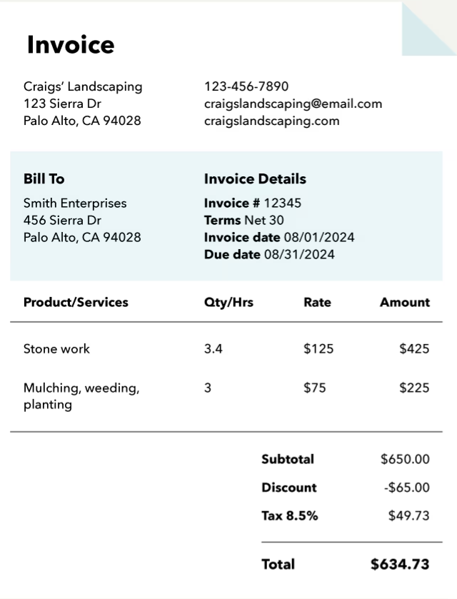
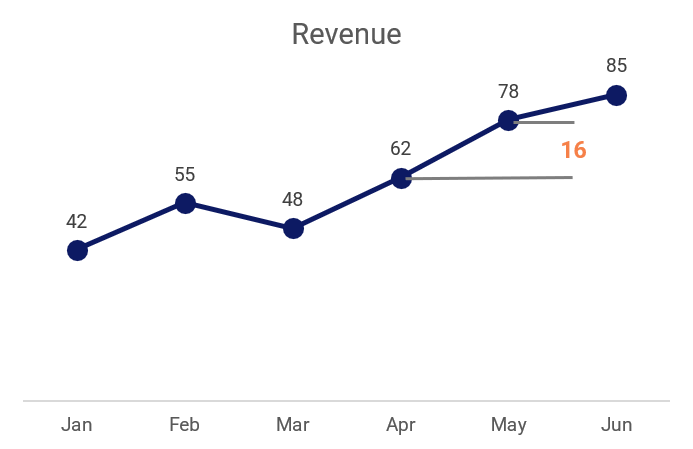

<!-- _class: title -->

# Data Visualisation
## Day 1 — From Data to Insight

---

**Course Introduction · Data Fundamentals · Tools · Data Types**

*9-week programme · Excel · Google Sheets · Python*

---

## Agenda — Day 1

<div class="cols">

<div>

**Morning**
1. Data → Information → Insight
2. Why visualisation matters
3. The visualisation workflow
4. Our three tools

</div>

<div>

**Afternoon**
5. Data types — the full picture
6. Which data type → which chart?
7. Hands-on exercise
8. Q & A + homework

</div>

</div>

<br>

> By end of day you will understand **what data is**, **what it becomes**, and **how we work with it** for the rest of this course.

---

<!-- _class: divider -->

<span class="part-no">01</span>

# What Is Data?

## And Why Does It Matter?


---

## Data · Information · Insight

<div class="cols-1-2">
<div style="margin-right: px;">

A single transaction:


</div>
<div>

Table record each transaction:

<div class="small-table">

| Date       | Invoice | Customer       | Product     | Qty | Unit Price | Total   |
|------------|---------|----------------|-------------|-----|------------|---------|
| 2024-01-03 | INV-001 | Alice Johnson  | Laptop X1   |   1 |     $899   |   $899  |
| 2024-02-14 | INV-002 | Bob Martinez   | Mouse Pro   |   3 |     $120   |   $360  |
| 2024-03-07 | INV-003 | Carol White    | Laptop X1   |   1 |     $899   |   $899  |
| 2024-01-22 | INV-004 | David Lee      | Keyboard K2 |   2 |     $150   |   $300  |
| 2024-04-11 | INV-005 | Emma Brown     | Monitor 27" |   1 |     $450   |   $450  |
| 2024-05-03 | INV-006 | Frank Wilson   | Mouse Pro   |   2 |     $120   |   $240  |
| 2024-02-28 | INV-007 | Grace Taylor   | Laptop X1   |   1 |     $899   |   $899  |
| 2024-06-15 | INV-008 | Henry Clark    | Monitor 27" |   2 |     $450   |   $900  |
| 2024-03-19 | INV-009 | Irene Scott    | Keyboard K2 |   1 |     $150   |   $150  |
| 2024-05-27 | INV-010 | James Rivera   | Mouse Pro   |   5 |     $120   |   $600  |
|...|

</div>

</div>

</div>


---

## Data · Information · Insight

<div class="cols-2-1">
<div>
Table record each transaction:
<div class="small-table">

| Date       | Invoice | Customer       | Product     | Qty | Unit Price | Total   |
|------------|---------|----------------|-------------|-----|------------|---------|
| 2024-01-03 | INV-001 | Alice Johnson  | Laptop X1   |   1 |     $899   |   $899  |
| 2024-02-14 | INV-002 | Bob Martinez   | Mouse Pro   |   3 |     $120   |   $360  |
| 2024-03-07 | INV-003 | Carol White    | Laptop X1   |   1 |     $899   |   $899  |
| 2024-01-22 | INV-004 | David Lee      | Keyboard K2 |   2 |     $150   |   $300  |
| 2024-04-11 | INV-005 | Emma Brown     | Monitor 27" |   1 |     $450   |   $450  |
| 2024-05-03 | INV-006 | Frank Wilson   | Mouse Pro   |   2 |     $120   |   $240  |
| 2024-02-28 | INV-007 | Grace Taylor   | Laptop X1   |   1 |     $899   |   $899  |
| 2024-06-15 | INV-008 | Henry Clark    | Monitor 27" |   2 |     $450   |   $900  |
| 2024-03-19 | INV-009 | Irene Scott    | Keyboard K2 |   1 |     $150   |   $150  |
| 2024-05-27 | INV-010 | James Rivera   | Mouse Pro   |   5 |     $120   |   $600  |
| ... |

</div>

</div>
  
<div>

Sum of transactions by month:

| Month | Revenue |
|---|---|
| Jan | 42 |
| Feb | 55 |
| Mar | 48 |
| Apr | 62 |
| May | 78 |
| Jun | 85 |

</div>
</div>

---

## Data · Information · Insight

<div class="cols3">

<div class="card">

### 📥 Data
Raw, unprocessed facts — no context, no meaning.

<br>

`42, 87, 13, 56`

`2024-01-03, North, 5000`

</div>

<div class="card mid">

### 📊 Information
Data **with context** — structured, labelled, comparable.

<br>

*"Monthly revenue Jan–Apr: 42k, 87k, 13k, 56k USD"*

</div>

<div class="card warm">

### 💡 Insight
Information that drives **action** — the "so what?" answer.

<br>

*"Revenue collapsed in March — investigate supply chain."*

</div>

</div>

<br>

> **Visualisation is the bridge** that turns information into insight at a glance.

---

## Why Visualisation Matters

<div class="cols">

<div>

**Without a chart** — find the biggest monthly jump:

| Month | Revenue |
|---|---|
| Jan | 42 |
| Feb | 55 |
| Mar | 48 |
| Apr | 62 |
| May | 78 |
| Jun | 85 |

*How long did that take?*

</div>

<div>

**With a line chart** — answer in under a second:




```

*Apr → May (+16k) is the biggest jump.*

```

</div>

</div>
---

## The Same Numbers — Three Levels

| Level | What you see | What you can do |
|---|---|---|
| **Data** | `42, 55, 48, 62, 78, 85, 92, 88, 95, 102, 98, 115` | Nothing yet |
| **Information** | Monthly revenue Jan–Dec (USD thousands) | Begin comparing |
| **Insight** | Revenue grew 174% over the year; Q3 was the inflection point | Make a decision |

<br>

<div class="box">

**The analyst's job:** move every stakeholder from the left column to the right column — as fast as possible.

</div>

---


## The Visualisation Workflow

Every session in this course follows the same pipeline:

<br>

<div class="box-navy">

```
Raw Data  ──▶  Clean & Structure  ──▶  Presentation Table
                                               │
                                               ▼
                                     Chart / Dashboard
                                               │
                                               ▼
                                       Story + Decision
```

</div>

<br>

We cover **every step** — not just the chart at the end.
The table step is where most analysts lose quality.

---

<!-- _class: divider -->

<span class="part-no">Ex01</span>
<div class="box-navy" style="width: 100%;">

```
Raw Data  ── ▶  Clean & Structure  ── ▶  Presentation Table ── ▶ Chart / Dashboard
```
*Ronnykym. (2020). Online Store Sales Data [Data set]. Kaggle.*

Use excel formulae or pivot table to report on sale by month of the year 2019 and 2020.

</div>


---
## Ex01
---

<!-- _class: divider -->

<span class="part-no">02</span>

# Our Tools

## Excel · Google Sheets · Python

---

---

## Three Tools, One Workflow

<div class="cols3">

<div class="card">

### Microsoft Excel

- Business reports
- Quick prototypes
- PivotTables
- One-off analysis

<br>

Insert → **Charts wizard**

</div>

<div class="card">

### Google Sheets

- Shared dashboards
- Live data feeds
- Team collaboration
- Cloud access

<br>

Insert → **Chart panel**

</div>

<div class="card warm">

### Python 🐍

- Large datasets
- Automation & scripts
- Publication quality
- Reproducible analysis

`matplotlib` `seaborn` `plotly`

</div>

</div>

<br>

*Knowing **which tool to reach for** is itself a professional skill.*

---

## Excel — Core Skills We Will Cover

<div class="cols">

<div>

**Data work**
- PivotTable — group, aggregate, pivot
- VLOOKUP / XLOOKUP — merge tables
- Conditional formatting
- Data validation

<br>

**Charts**
Line · Bar · Pie · Waterfall
Funnel · Stock (Candlestick) · Combo

</div>

<div>

**First exercise preview**

```
Raw transaction log
────────────────────────
Date  | Region | Revenue
Jan 3 | North  | 5,000
Jan 5 | South  | 4,500
...

        ▼  PivotTable

Region | Q1    | Q2
North  | 42k   | 55k
South  | 38k   | 47k
```

</div>

</div>

---

## Google Sheets — When to Choose It

<div class="cols">

<div>

**Strengths over Excel**

- Real-time multi-user editing
- Built-in `QUERY()` — SQL-like filtering
- `IMPORTRANGE()` — live data from another sheet
- Free, browser-based, easy sharing
- Native connection to Google Data Studio

</div>

<div>

| Situation | Choose |
|---|---|
| Colleagues editing simultaneously | **Sheets** |
| Data stays on your machine | **Excel** |
| Pulling live web / API data | **Sheets** |
| Complex macros / VBA | **Excel** |
| Sharing with non-Office users | **Sheets** |
| Large files (> 100MB) | **Excel** |

</div>

</div>

---

## Python — Three Libraries, Three Purposes

<div class="cols3">

<div class="card">

### matplotlib

The **foundation**. Full manual control over every element.

```python
import matplotlib.pyplot as plt

plt.plot(months, revenue,
         color='#0D1A63')
plt.title('Monthly Revenue')
plt.show()
```

</div>

<div class="card mid">

### seaborn

**Statistical charts** with minimal code. Built on matplotlib.

```python
import seaborn as sns

sns.boxplot(
  x='Group',
  y='Score',
  data=df
)
```

</div>

<div class="card warm">

### plotly

**Interactive** charts — hover, zoom, filter. Web & dashboards.

```python
import plotly.express as px

fig = px.bar(df,
  x='Month',
  y='Revenue')
fig.show()
```

</div>

</div>

---


# Data Types

## A Important Concept in Visualisation

---

---

## Why Data Types Matter

**The data type determines the chart — not the other way around.**

<div class="box">
Trying to draw a line chart on nominal categories, or a pie chart on continuous data, produces charts that are meaningless — or actively misleading.
</div>

<br>

| Data type | Examples | Suitable charts |
|---|---|---|
| **Continuous** | Revenue, temperature, height | Line, scatter, histogram |
| **Discrete** | Customers, units, page views | Bar, dot plot |
| **Nominal** | Country, product name, channel | Bar, pie, treemap |
| **Ordinal** | Rating: Poor / Good / Excellent | Bar, heatmap |
| **Temporal** | Dates, timestamps | Line, area, candlestick |
| **Geospatial** | City, coordinates, country | Map, choropleth |

---

## Quantitative — Continuous vs Discrete

<div class="cols">

<div>

### Continuous

Can take **any value** in a range — infinitely many possible values exist between two points.

<br>

**Examples**
- Revenue: $47,382.56
- Temperature: 36.8°C
- Height: 1.73 m
- Profit margin: 12.4%

<br>

**Key charts**
Line · Scatter · Histogram · Box Plot

</div>

<div>

### Discrete

**Countable whole numbers** only.
You cannot have 2.5 customers.

<br>

**Examples**
- Customers: 847
- Units sold: 1,200
- Page views: 54,321
- Support tickets: 7

<br>

**Key charts**
Bar · Column · Dot Plot

</div>

</div>

---

## Categorical — Nominal vs Ordinal

<div class="cols">

<div>

### Nominal

Categories with **no natural order**.
You cannot say North > South.

<br>

**Examples**
- Region: North / South / East / West
- Product: Widget A / Widget B
- Channel: Email / Social / Search
- Country: Vietnam / USA / UK

<br>

**Key charts**
Bar · Pie · Donut · Treemap

</div>

<div>

### Ordinal

Categories **with a meaningful order** — but the gap between levels may not be equal.

<br>

**Examples**
- Rating: Poor · Fair · Good · Excellent
- Education: High School · Bachelor's · Master's
- Priority: Low · Medium · High · Critical
- NPS: Detractor · Passive · Promoter

<br>

**Key charts**
Bar (sorted) · Heatmap · Stacked Bar

</div>

</div>

---

## Temporal — Time-based Data

Data recorded at **points in time** or over **time intervals**.

<div class="cols">

<div>

**Regular intervals**

Daily stock prices, monthly sales, hourly temperature readings.

The gap between points is constant — patterns like seasonality and trends become visible.

**Charts:** Line · Area · Candlestick · Calendar Heatmap

</div>

<div>

**Irregular intervals**

Customer purchase timestamps, server log events, support tickets.

Points are unevenly spaced — aggregation (hourly → daily → monthly) is needed first.

**Charts:** Line after aggregation · Event timeline

</div>

</div>

<br>

> **Golden rule:** Time always goes on the **X-axis**. The metric goes on the **Y-axis**.

---

## Geospatial Data

Data with a **location** component.

<div class="cols">

<div>

**Types of location data**

| Type | Example |
|---|---|
| Country name | "Vietnam", "USA" |
| Region / Province | "North", "HCMC" |
| Coordinates | lat 10.8°, lon 106.7° |
| Postal code | 70000 |
| Address | "123 Nguyen Hue St" |

</div>

<div>

**Key charts**

**Choropleth map** — colour regions by value (sales by country)

**Dot / bubble map** — sized dots at coordinates (store locations)

**Geo heatmap** — density of events (customer clusters)

*We cover choropleth maps using `plotly` in Part 2.*

</div>

</div>

---

## The Data-Type Decision Tree

```
What is your data type?
│
├── Numeric + time axis?             ──▶  Line / Area / Candlestick
│
├── Numeric, comparing groups?       ──▶  Bar / Box Plot / Violin
│
├── Numeric, one variable only?      ──▶  Histogram
│
├── Two numeric variables?           ──▶  Scatter Plot
│
├── Categorical, part of a whole?    ──▶  Pie / Donut / Treemap
│
├── Categorical, comparing values?   ──▶  Bar Chart (sorted)
│
└── Location?                        ──▶  Map / Choropleth
```

---

## Common Mistakes with Data Types

<div class="cols">

<div>

❌ **Line chart on nominal data**

Connecting "North → South → East" with a line implies a trend or order that does not exist.

*Fix: use a bar chart.*

<br>

❌ **Pie chart with too many categories**

A 12-slice pie chart is unreadable.

*Fix: use a sorted bar chart or treemap.*

</div>

<div>

❌ **Averaging ordinal data**

*"Average satisfaction: 2.7"* — implies equal spacing between ratings that may not exist.

*Fix: use frequency percentages.*

<br>

✅ **Match chart to data type**

The chart type is not a style choice — it is a statement about the **structure of your data**.

</div>

</div>

---

<!-- _class: divider -->

<span class="part-no">04</span>

# Hands-On

## Identify Data Types in a Real Dataset

---

---

## Exercise — Label Every Column

Look at this dataset. Working in pairs, label each column with its data type.

| Date | Salesperson | Region | Product | Units Sold | Unit Price | Revenue |
|---|---|---|---|---|---|---|
| Jan 03 | Alice | North | Widget A | 50 | 100 | 5,000 |
| Jan 05 | Bob | South | Widget B | 30 | 150 | 4,500 |
| Jan 12 | Carol | East | Widget A | 40 | 100 | 4,000 |

<br>

**Discuss for 3 minutes:**
- Which columns are numerical? Continuous or discrete?
- Which are categorical? Nominal or ordinal?
- Which is temporal?
- What charts could we build from this data?

---

## Exercise — Answers

| Column | Data Type | Reason |
|---|---|---|
| **Date** | Temporal | Ordered time series — trend charts possible |
| **Salesperson** | Nominal | Names, no natural rank order |
| **Region** | Nominal | Locations, no natural rank order |
| **Product** | Nominal | Category labels, no order |
| **Units Sold** | Discrete | Whole numbers only, countable |
| **Unit Price** | Continuous | Can be any decimal value |
| **Revenue** | Continuous | Derived from Units × Price, any decimal |

<br>

**Charts we can build:**
Revenue over time (line) · Revenue by region (bar) · Product mix (pie) · Units vs Price (scatter)

---

## Day 1 — Key Takeaways

<div class="cols">

<div>

**Core concepts**

- **Data** = raw facts, no meaning alone
- **Information** = data with context
- **Insight** = information that drives action
- Visualisation accelerates the journey

<hr>

**Data types**
Continuous · Discrete · Nominal · Ordinal · Temporal · Geospatial

*Data type determines chart — not personal preference.*

</div>

<div>

**Tools**
- **Excel** — fast, offline, business standard
- **Sheets** — collaborative, cloud, live data
- **Python** — powerful, automated, reproducible
  - `matplotlib` foundations
  - `seaborn` statistics
  - `plotly` interactive

<hr>

**Workflow**

Raw Data → Clean Table → Chart → Insight

</div>

</div>

---

## Homework Before Day 2

<br>

**1. Data types in the wild**
Find any report, news article, or dashboard. Label every column or axis label with its data type and write two sentences explaining your choices.

<br>

**2. Environment check**
Activate the `venv` and run:
```python
import matplotlib; print(matplotlib.__version__)
```

<br>

**3. Optional reading**
*Storytelling with Data* — Chapter 1: "The importance of context"

---

<!-- _class: title -->

# See You on Day 2

## Finance Visualisation

---

**Next session covers:**
Trial Balance · P&L Statement · Balance Sheet · Waterfall Chart · Candlestick Chart

<br>

*Questions before Day 2? Reach out anytime.*
