# Data Visualisation — Teaching Plan

---

## Overview

This course teaches data visualisation from first principles through applied practice. Students will learn to choose the right chart for the right context, build visualisations using Excel, Google Sheets, and Python, and read and produce professional charts across three industry domains: Finance, Sales & Marketing, and Science.

**Tools covered:** Microsoft Excel · Google Sheets · Python (matplotlib, seaborn, plotly)

---

## Part 0 — Foundations: Data, Information & Data Types

### 0.1 What is Data vs. Information?

| Concept | Definition | Example |
|---|---|---|
| **Data** | Raw, unprocessed facts and figures | `42, 87, 13, 56` |
| **Information** | Data with context and meaning | "Monthly sales in USD: Jan=42k, Feb=87k…" |
| **Insight** | Actionable understanding derived from information | "Sales peak in Q2 — increase stock in March" |

Visualisation is the bridge between raw data and human understanding.

### 0.2 Data Types

Understanding data types determines which chart you can and should use.

#### Quantitative (Numerical)
- **Continuous** — can take any value in a range (temperature, revenue, height)
- **Discrete** — countable whole numbers (number of customers, units sold)

#### Categorical (Qualitative)
- **Nominal** — categories with no inherent order (product names, country, colour)
- **Ordinal** — categories with a meaningful order (survey ratings: Poor / Fair / Good / Excellent)

#### Time-based (Temporal)
- Data recorded at regular or irregular time intervals (daily stock prices, monthly sales)

#### Geospatial
- Data tied to a location (sales by region, store coordinates)

### 0.3 The Data-to-Chart Decision Framework

```
What question are you answering?
│
├── Comparison between categories?   → Bar / Column Chart
├── Change over time?                → Line Chart
├── Part of a whole?                 → Pie / Donut / Treemap
├── Distribution of values?          → Histogram / Box Plot / Violin Plot
├── Relationship between variables?  → Scatter Plot
├── Magnitude / ranking?             → Bar Chart (sorted)
└── Geography?                       → Map / Choropleth
```

### 0.4 Introduction to Tools

| Tool | Strengths | Best For |
|---|---|---|
| **Excel** | Familiar, fast prototyping, built-in chart wizard | Business reports, quick one-off charts |
| **Google Sheets** | Cloud-based, collaboration, live data connections | Shared dashboards, team reports |
| **Python** | Fully programmable, reproducible, publication-quality | Large datasets, automation, science |

**Python libraries used in this course:**
- `matplotlib` — foundational, full control over every element
- `seaborn` — statistical charts with minimal code
- `plotly` — interactive charts for web and dashboards

---

## Part 0.5 — Step 1: Converting Raw Data into Presentation Tables

Before any chart can be built, raw data must be restructured into a clean, meaningful table. This is the fundamental first step in every visualisation workflow. A well-structured table is itself a form of communication — and it is the source from which all charts are built.

### Why this matters

Raw data is collected for recording, not reading. It contains redundancy, mixed granularity, and no hierarchy. A presentation table reorganises that data to answer a specific question for a specific audience.

```
Raw Data  →  Clean Presentation Table  →  Chart / Dashboard
```

---

### 0.5.1 Finance — Trial Balance → Balance Sheet & P&L

#### Raw Data: Trial Balance

The trial balance is the raw ledger output — every account with its debit or credit balance.

| Account | Category | Debit (USD) | Credit (USD) |
|---|---|---:|---:|
| Cash | Asset | 45,000 | |
| Accounts Receivable | Asset | 32,000 | |
| Inventory | Asset | 18,000 | |
| Equipment | Asset | 120,000 | |
| Accumulated Depreciation | Asset (contra) | | 20,000 |
| Accounts Payable | Liability | | 28,000 |
| Long-term Debt | Liability | | 70,000 |
| Common Stock | Equity | | 50,000 |
| Retained Earnings (opening) | Equity | | 15,000 |
| Revenue | Income | | 250,000 |
| Cost of Goods Sold | Expense | 150,000 | |
| Salaries Expense | Expense | 45,000 | |
| Rent Expense | Expense | 12,000 | |
| Utilities Expense | Expense | 8,000 | |
| Depreciation Expense | Expense | 3,000 | |
| **Total** | | **433,000** | **433,000** |

---

#### Presentation Table 1: Profit & Loss Statement

Group all Income and Expense rows; compute subtotals and net income.

| | USD |
|---|---:|
| **Revenue** | |
| Sales Revenue | 250,000 |
| **Total Revenue** | **250,000** |
| | |
| **Cost of Goods Sold** | |
| Direct Costs | (150,000) |
| **Gross Profit** | **100,000** |
| *Gross Margin* | *40.0%* |
| | |
| **Operating Expenses** | |
| Salaries | (45,000) |
| Rent | (12,000) |
| Utilities | (8,000) |
| Depreciation | (3,000) |
| **Total Operating Expenses** | **(68,000)** |
| | |
| **Net Income (EBIT)** | **32,000** |
| *Net Margin* | *12.8%* |

---

#### Presentation Table 2: Balance Sheet

Group all Asset, Liability, and Equity accounts; apply hierarchy and verify the accounting equation (Assets = Liabilities + Equity).

| | USD | USD |
|---|---:|---:|
| **ASSETS** | | |
| *Current Assets* | | |
| Cash | 45,000 | |
| Accounts Receivable | 32,000 | |
| Inventory | 18,000 | |
| **Total Current Assets** | | **95,000** |
| *Non-current Assets* | | |
| Equipment | 120,000 | |
| Less: Accumulated Depreciation | (20,000) | |
| **Net Equipment** | | **100,000** |
| **TOTAL ASSETS** | | **195,000** |
| | | |
| **LIABILITIES** | | |
| Accounts Payable | 28,000 | |
| Long-term Debt | 70,000 | |
| **Total Liabilities** | | **98,000** |
| | | |
| **EQUITY** | | |
| Common Stock | 50,000 | |
| Retained Earnings (opening) | 15,000 | |
| Current Period Net Income | 32,000 | |
| **Total Equity** | | **97,000** |
| **TOTAL LIABILITIES + EQUITY** | | **195,000** ✓ |

> **Key transformation rules:** Revenue and expense accounts → P&L. Asset, liability, and equity accounts → Balance Sheet. Net income from P&L flows into equity on the Balance Sheet.

---

### 0.5.2 Sales & Marketing — Transaction Log → Sales Report

#### Raw Data: Sales Transaction Log

Each row is one transaction — the system's raw output.

| Date | Salesperson | Region | Product | Units Sold | Unit Price (USD) | Revenue (USD) |
|---|---|---|---|---:|---:|---:|
| Jan 03 | Alice | North | Widget A | 50 | 100 | 5,000 |
| Jan 05 | Bob | South | Widget B | 30 | 150 | 4,500 |
| Jan 08 | Alice | North | Widget B | 20 | 150 | 3,000 |
| Jan 12 | Carol | East | Widget A | 40 | 100 | 4,000 |
| Jan 15 | Bob | South | Widget A | 60 | 100 | 6,000 |
| Feb 02 | Carol | East | Widget B | 25 | 150 | 3,750 |
| Feb 10 | Alice | North | Widget A | 45 | 100 | 4,500 |
| Feb 18 | Bob | South | Widget B | 35 | 150 | 5,250 |

---

#### Presentation Table 1: Revenue by Region & Product (Pivot)

Aggregate by Region and Product using a pivot structure.

| Region | Widget A (USD) | Widget B (USD) | Total Revenue (USD) | % of Total |
|---|---:|---:|---:|---:|
| North | 9,500 | 3,000 | 12,500 | 34.7% |
| South | 6,000 | 9,750 | 15,750 | 43.8% |
| East | 4,000 | 3,750 | 7,750 | 21.5% |
| **Total** | **19,500** | **16,500** | **36,000** | **100%** |

---

#### Presentation Table 2: Salesperson Performance Summary

Aggregate by salesperson; add KPIs that are not in the raw data.

| Salesperson | Transactions | Units Sold | Revenue (USD) | Avg Deal Size (USD) | Revenue Share |
|---|---:|---:|---:|---:|---:|
| Bob | 3 | 125 | 15,750 | 5,250 | 43.8% |
| Alice | 3 | 115 | 12,500 | 4,167 | 34.7% |
| Carol | 2 | 65 | 7,750 | 3,875 | 21.5% |
| **Total** | **8** | **305** | **36,000** | **4,500** | **100%** |

> **Key transformation rules:** Use GROUP BY (pivot) to collapse many rows into summary rows. Add computed columns (% of total, averages) that give context raw data cannot provide.

---

### 0.5.3 Science — Raw Measurements → Summary Statistics Table

#### Raw Data: Experimental Measurements

Each row is one observation from an experiment testing three dosage groups.

| Sample ID | Group | Trial 1 | Trial 2 | Trial 3 | Notes |
|---|---|---:|---:|---:|---|
| S01 | Control | 45.2 | 46.8 | 44.9 | |
| S02 | Control | 48.1 | 47.5 | 49.2 | |
| S03 | Control | 43.7 | 44.1 | 45.5 | outlier flagged |
| S04 | Treatment A | 57.3 | 58.9 | 56.8 | |
| S05 | Treatment A | 60.1 | 59.5 | 61.2 | |
| S06 | Treatment A | 55.8 | 57.2 | 56.5 | |
| S07 | Treatment B | 70.4 | 72.1 | 69.8 | |
| S08 | Treatment B | 73.5 | 74.2 | 72.9 | |
| S09 | Treatment B | 68.9 | 70.3 | 71.0 | |
| *(n = 15 per group — abbreviated above)* | | | | | |

---

#### Presentation Table: Summary Statistics for Publication

Average each sample's trials; then compute group-level statistics across all 15 samples per group.

| Group | n | Mean | SD | Min | Max | 95% CI |
|---|---:|---:|---:|---:|---:|---|
| Control | 15 | 46.8 | 3.2 | 41.0 | 52.5 | 45.0 – 48.6 |
| Treatment A | 15 | 58.3 | 4.1 | 51.2 | 65.8 | 56.1 – 60.5 |
| Treatment B | 15 | 71.5 | 3.8 | 64.9 | 78.2 | 69.4 – 73.6 |

> **Key transformation rules:** Average repeated trials within each sample first (reduce noise), then compute group statistics. Always report n, mean, and a measure of spread (SD or 95% CI) — never mean alone. Flag and document any excluded outliers.

---

### 0.5.4 The General Workflow (applies to all domains)

| Step | Action | Tool |
|---|---|---|
| 1 | Receive raw data | Excel / Google Sheets / CSV |
| 2 | Inspect: check for blanks, duplicates, wrong data types | Excel Data → Filter; Python `df.info()` |
| 3 | Clean: fix errors, standardise formats, handle missing values | Excel Find & Replace; Python `pandas` |
| 4 | Structure: sort, group, aggregate into the target table shape | Excel PivotTable; Python `df.groupby()` |
| 5 | Add computed columns: %, ratios, subtotals | Excel formula; Python `df['col'] = ...` |
| 6 | Format: currency, %, decimal places, bold headers, borders | Excel cell format; Python `tabulate` / `to_latex()` |
| 7 | Validate: totals must reconcile, counts must match source | Cross-check manually or with Python assertions |

---

## Part 1 — Finance Visualisation

### Context

Finance visualisation communicates performance, risk, and value over time. Audiences include executives, analysts, investors, and auditors. Precision and clarity are paramount — a misread chart can lead to a costly decision.

### 1.1 Chart Types in Finance

---

#### Line Chart

**Use when:** Showing a metric's change over time (stock prices, revenue growth, interest rates).

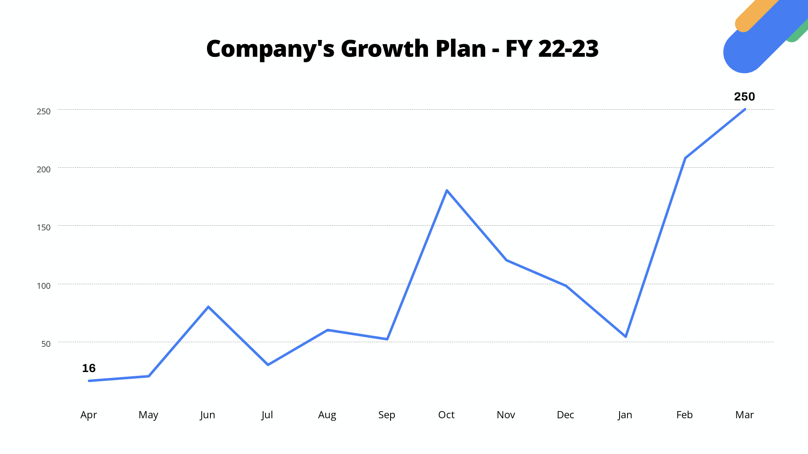

**Key features:**
- X-axis = time (date, quarter, year)
- Y-axis = the metric (price, revenue)
- Multiple lines = multiple assets or scenarios

**Excel:** Insert → Charts → Line
**Google Sheets:** Insert → Chart → Line chart
**Python:**
```python
import matplotlib.pyplot as plt
plt.plot(dates, revenue)
plt.title("Monthly Revenue 2024")
plt.xlabel("Month")
plt.ylabel("Revenue (USD)")
plt.show()
```

---

#### Candlestick Chart

**Use when:** Visualising stock or commodity price movement over a period (OHLC data).

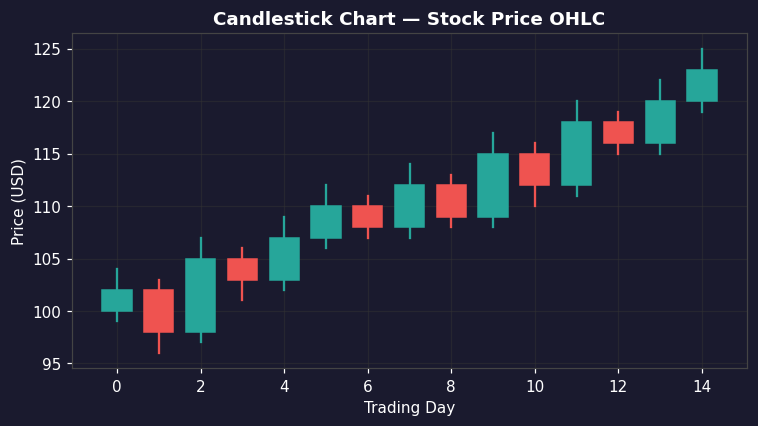

**Key features:**
- Each "candle" encodes 4 values: Open, High, Low, Close
- Green candle = price closed higher than it opened
- Red candle = price closed lower than it opened
- "Wicks" show the intraday high and low range

**Excel:** Use stock chart type (requires OHLC columns in order)
**Python:**
```python
import plotly.graph_objects as go
fig = go.Figure(data=[go.Candlestick(x=df['Date'],
    open=df['Open'], high=df['High'],
    low=df['Low'], close=df['Close'])])
fig.show()
```

---

#### Waterfall Chart

**Use when:** Breaking down how an initial value increases or decreases to reach a final value. Classic for P&L statements and variance analysis.

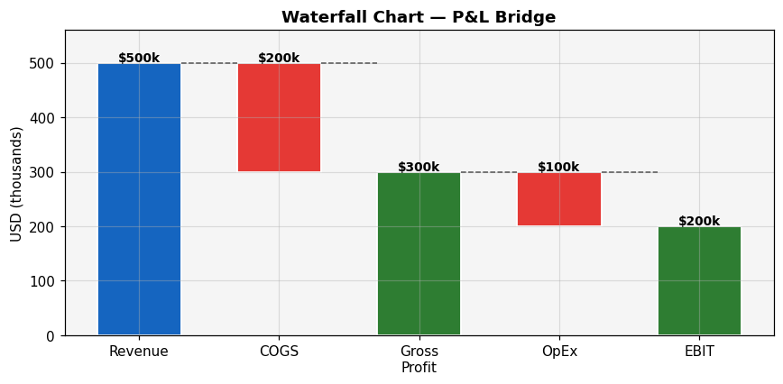

**Key features:**
- Floating bars show incremental changes (positive = up, negative = down)
- Starting total, individual drivers, and ending total are visible at once
- Ideal for: income statements, budget vs. actual bridges, cash flow analysis

**Excel:** Insert → Charts → Waterfall (Excel 2016+)
**Python:**
```python
import plotly.graph_objects as go
fig = go.Figure(go.Waterfall(
    name="P&L", orientation="v",
    measure=["absolute", "relative", "relative", "total"],
    x=["Revenue", "COGS", "OpEx", "Net Profit"],
    y=[500000, -200000, -100000, 0]))
fig.show()
```

---

#### Bar / Column Chart

**Use when:** Comparing values across discrete categories (revenue by product line, costs by department, quarterly EPS).

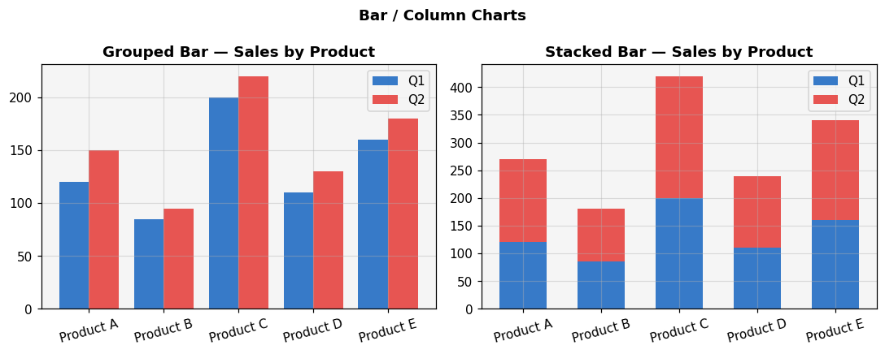

**Key features:**
- Vertical (column) = most common for time-based comparisons
- Horizontal = better for many categories or long labels
- Stacked bars = show both total and composition

---

#### Treemap

**Use when:** Showing hierarchical financial data and proportions simultaneously (portfolio allocation, expense breakdown by department and sub-category).

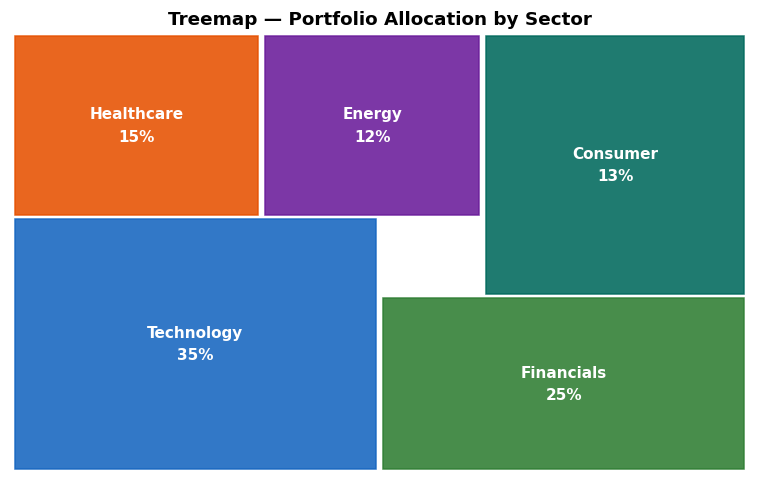

**Key features:**
- Nested rectangles where size = value
- Colour can encode a second metric (e.g., performance)
- More space-efficient than pie charts for many categories

**Python:**
```python
import plotly.express as px
fig = px.treemap(df, path=['Sector', 'Company'], values='MarketCap',
                 color='Return', color_continuous_scale='RdYlGn')
fig.show()
```

---

#### Heatmap (Correlation / Calendar)

**Use when:** Identifying patterns across two dimensions — e.g., correlation between financial metrics, or trading volume by day-of-week and month.

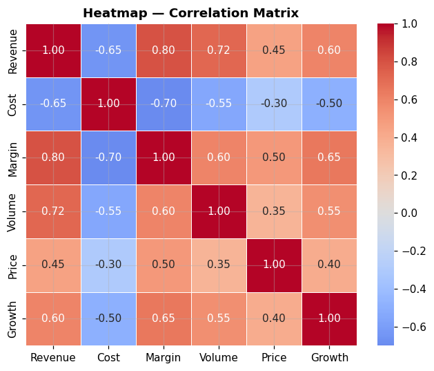

**Python:**
```python
import seaborn as sns
sns.heatmap(df.corr(), annot=True, cmap='coolwarm')
```

---

#### Bullet Chart

**Use when:** Comparing a single KPI against a target and performance ranges. A compact, information-dense alternative to a gauge chart.

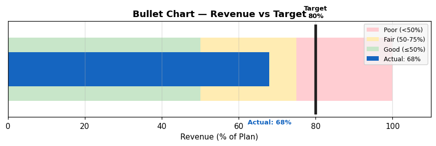

**Key features:**
- Horizontal bar = actual value
- Vertical line marker = target
- Background bands = performance zones (poor / satisfactory / good)

---

#### Sankey Diagram

**Use when:** Showing the flow of money through a system — revenue sources, cost allocation, cash flow pathways.


**Python:**
```python
import plotly.graph_objects as go
fig = go.Figure(data=[go.Sankey(
    node=dict(label=["Revenue", "COGS", "Gross Profit", "OpEx", "EBIT"]),
    link=dict(source=[0,0,2,2], target=[1,2,3,4], value=[200,300,100,200]))])
fig.show()
```

---

#### Radar / Spider Chart

**Use when:** Comparing multiple financial metrics (liquidity, profitability, leverage) across companies or time periods.

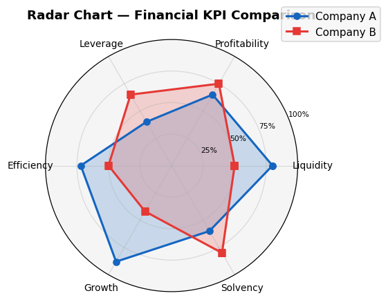

---

### 1.2 Finance Practice Projects

1. Plot a company's 5-year revenue and net income trend (line chart)
2. Build a P&L waterfall for a fictional company
3. Create a portfolio allocation treemap
4. Display monthly stock OHLC data as a candlestick chart

---

## Part 2 — Sales & Marketing Visualisation

### Context

Sales and marketing visualisation communicates customer behaviour, campaign performance, pipeline health, and market share. Audiences are often non-technical: managers, executives, and clients. Charts must be immediately readable and action-oriented.

### 2.1 Chart Types in Sales & Marketing

---

#### Bar / Column Chart

**Use when:** Comparing sales across products, regions, channels, or time periods. The most versatile chart in business reporting.


**Variants:**
- **Grouped bar** — compare multiple series side by side (sales by product per quarter)
- **Stacked bar** — show total and composition (sales by channel per region)
- **100% stacked bar** — show proportional breakdown (market share over time)

---

#### Line Chart

**Use when:** Tracking a KPI over time — monthly revenue, daily active users, weekly conversion rate, campaign impressions.


**Best practices:**
- Annotate significant events (campaign launch, product release)
- Use dual axes sparingly; prefer two separate charts

---

#### Pie / Donut Chart

**Use when:** Showing how a whole is divided into parts with 5 or fewer segments (market share, traffic source split, lead source breakdown).

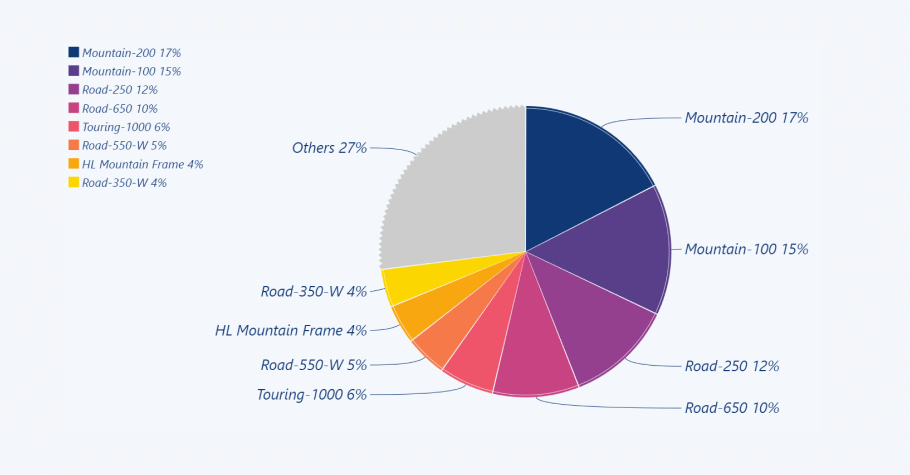

**Donut chart** — same as pie but with hollow centre; often used for a single KPI in the centre label.

**Excel / Google Sheets:** Straightforward built-in chart type
**Python:**
```python
import matplotlib.pyplot as plt
plt.pie(sizes, labels=labels, autopct='%1.1f%%', startangle=90)
```

---

#### Funnel Chart

**Use when:** Visualising a sales or marketing pipeline — showing how leads drop off at each stage (Awareness → Interest → Consideration → Intent → Purchase).

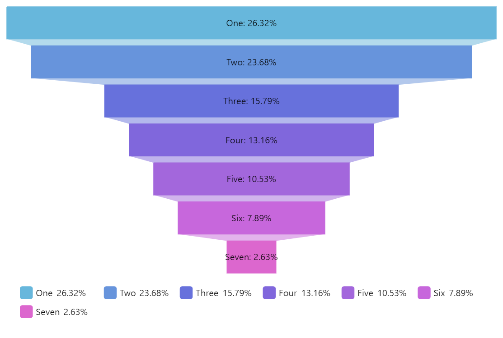

**Key features:**
- Each stage is narrower than the previous, reflecting attrition
- Width or height represents volume at each stage
- Conversion rate between stages is the key metric

**Excel:** Insert → Charts → Funnel (Excel 2019+)
**Python:**
```python
import plotly.graph_objects as go
fig = go.Figure(go.Funnel(
    y=["Leads", "Qualified", "Proposals", "Negotiations", "Won"],
    x=[1000, 600, 300, 150, 80]))
fig.show()
```

---

#### Scatter Plot

**Use when:** Identifying the relationship between two marketing variables — e.g., ad spend vs. conversions, price vs. demand, email sends vs. open rate.

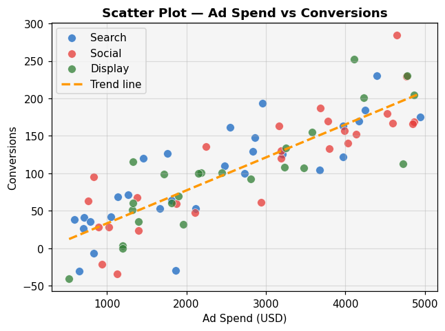

**Key features:**
- Each dot = one data point (e.g., one campaign or one customer)
- Trend line (linear regression) can be overlaid to show direction
- Bubble chart variant: add a 3rd variable via dot size

---

#### Heatmap (Engagement / Cohort)

**Use when:** Showing patterns across two categorical dimensions — website clicks by hour and day-of-week, cohort retention rates, A/B test results by segment.


---

#### Geographic / Choropleth Map

**Use when:** Showing regional performance — sales by state, customer density by city, market penetration by country.

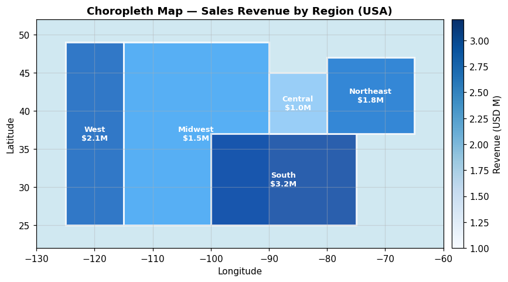

**Python:**
```python
import plotly.express as px
fig = px.choropleth(df, locations='Country', color='Sales',
                    color_continuous_scale='Blues')
fig.show()
```

---

#### Gauge / KPI Scorecard

**Use when:** Displaying a single headline metric against a target (NPS score, conversion rate, monthly revenue vs. goal). Used heavily in executive dashboards.

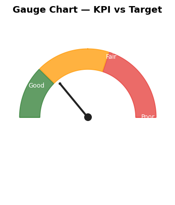

---

#### Area Chart

**Use when:** Showing cumulative volume over time — total pageviews, total revenue, stacked channel contributions to overall traffic.

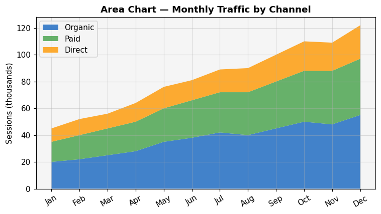

**Stacked area chart** = shows both individual and total contributions over time.

---

#### Bubble Chart

**Use when:** Comparing three variables simultaneously — e.g., (Market Size, Growth Rate, Market Share) for a portfolio of products or markets (BCG matrix style).

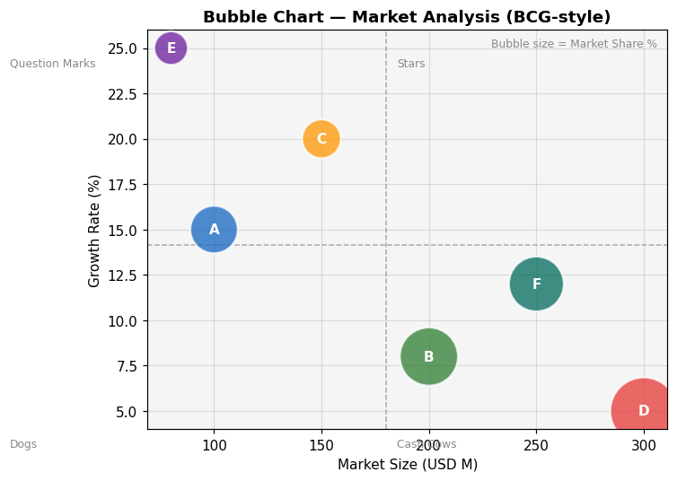

---

#### Sankey Diagram

**Use when:** Tracing customer journeys or attribution flows — showing which channels lead to conversions, or how users move through a website.


---

### 2.2 Sales & Marketing Practice Projects

1. Build a monthly sales trend dashboard (line + bar combo)
2. Create a lead-to-close funnel chart
3. Visualise traffic source split with a donut chart
4. Map sales by region with a choropleth
5. Plot ad spend vs. conversions as a scatter plot with trend line

---

## Part 3 — Science Visualisation

### Context

Science visualisation communicates empirical findings, statistical distributions, experimental results, and model outputs. The audience ranges from fellow researchers to the general public. Accuracy, reproducibility, and honest representation of uncertainty are critical requirements.

### 3.1 Chart Types in Science

---

#### Histogram

**Use when:** Showing the distribution of a single continuous variable — how values cluster and spread (reaction times, measurement errors, test scores, particle energies).

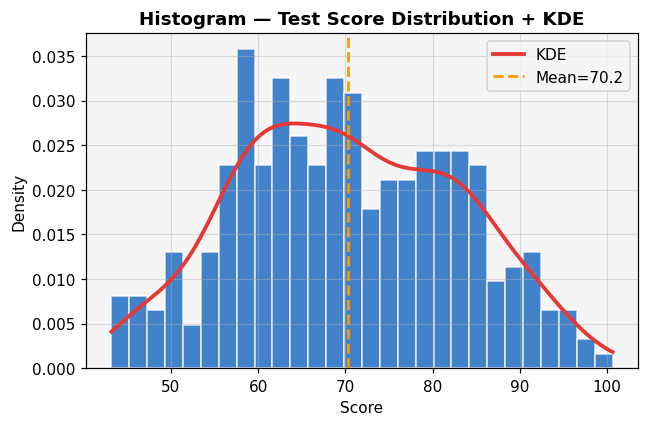

**Key features:**
- X-axis = value bins; Y-axis = frequency or density
- Bin width significantly affects interpretation — always choose deliberately
- Can overlay a KDE (kernel density estimate) curve for smoothness

**Python:**
```python
import seaborn as sns
sns.histplot(data, kde=True, bins=30)
```

---

#### Box Plot (Box-and-Whisker)

**Use when:** Comparing distributions across multiple groups — e.g., test scores by school, reaction times by condition, gene expression by cell type.

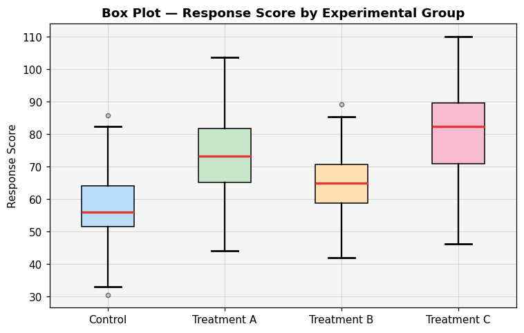

**Key features:**
- Box spans IQR (25th–75th percentile)
- Line inside box = median
- Whiskers typically extend to 1.5× IQR
- Points beyond whiskers = outliers

**Python:**
```python
import seaborn as sns
sns.boxplot(x='Group', y='Value', data=df)
```

---

#### Violin Plot

**Use when:** Comparing distributions like a box plot, but also showing the full shape of the distribution (bimodal, skewed, etc.).

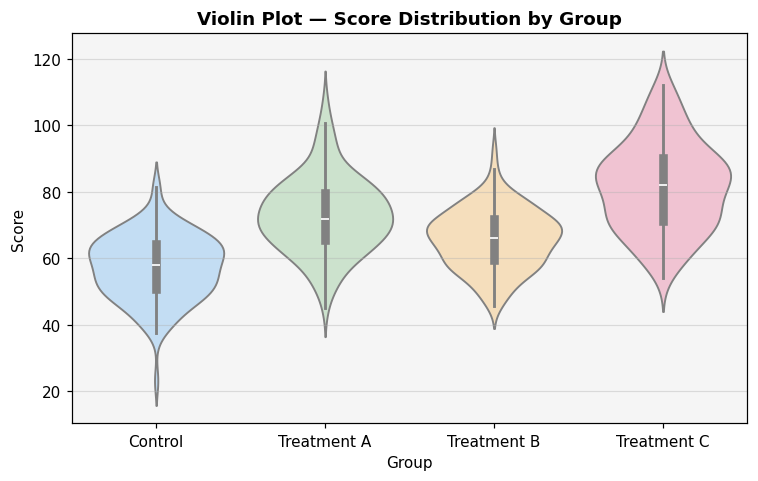

**Key features:**
- Combines a KDE curve (the "violin" shape) with a box plot inside
- Wider sections = more data points at that value
- Better than box plots when distribution shape matters

**Python:**
```python
import seaborn as sns
sns.violinplot(x='Group', y='Value', data=df, inner='box')
```

---

#### Scatter Plot

**Use when:** Showing the relationship between two continuous variables — correlation, regression, clustering.


**Key features:**
- Each point = one observation
- Overlay regression line to quantify the relationship
- Use colour or shape to encode a third categorical variable
- Log scale axes useful for data spanning many orders of magnitude

**Python:**
```python
import seaborn as sns
sns.scatterplot(x='Variable1', y='Variable2', hue='Category', data=df)
```

---

#### Line Chart (Time Series / Experimental)

**Use when:** Plotting a measured quantity over time or a continuous independent variable — growth curves, spectral data, climate records, dose-response curves.


**Key features:**
- Error bands (±1 SD or 95% CI) communicate uncertainty around the mean
- Multiple lines = multiple experimental conditions

**Python:**
```python
import matplotlib.pyplot as plt
plt.plot(x, y_mean)
plt.fill_between(x, y_mean - y_std, y_mean + y_std, alpha=0.3)
```

---

#### Heatmap

**Use when:** Displaying a matrix of values — gene expression matrices, correlation matrices, confusion matrices, climate data by month and year.


**Key features:**
- Colour intensity = cell value
- Hierarchical clustering can be applied to rows/columns to reveal structure
- Always include a colour scale bar with units

**Python:**
```python
import seaborn as sns
sns.heatmap(matrix, annot=True, cmap='viridis', fmt='.2f')
```

---

#### Error Bar Chart

**Use when:** Showing experimental measurements with their associated uncertainty — mean values with standard deviation or confidence intervals.

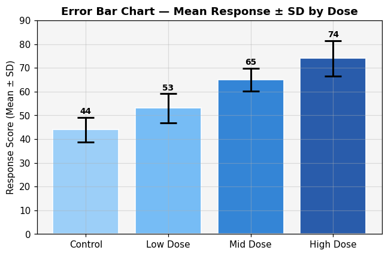

**Key features:**
- Critical in peer-reviewed science — never present a mean without uncertainty
- Error bars can represent SD, SEM, or 95% CI (always label which)

**Python:**
```python
import matplotlib.pyplot as plt
plt.errorbar(x, y_mean, yerr=y_error, fmt='o', capsize=5)
```

---

#### Scatter Matrix (Pair Plot)

**Use when:** Exploring relationships between multiple variables simultaneously in a dataset — used heavily in exploratory data analysis (EDA).

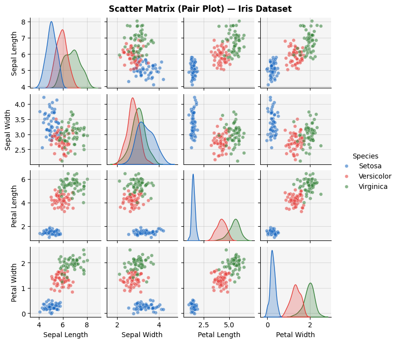

**Key features:**
- Grid of scatter plots for every variable pair
- Diagonal shows each variable's own distribution (histogram or KDE)
- Colour-coded by class/group for classification problems

**Python:**
```python
import seaborn as sns
sns.pairplot(df, hue='Species')
```

---

#### Rose / Polar Chart

**Use when:** Displaying cyclical or directional data — wind direction and frequency, seasonal patterns, angular measurements.

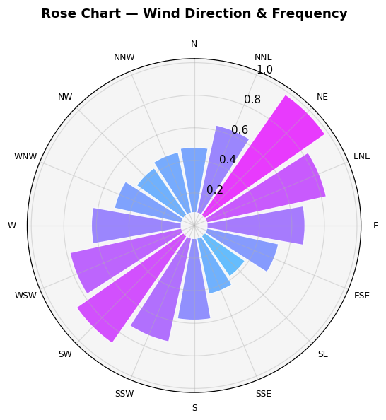

---

#### 3D Surface / Contour Plot

**Use when:** Visualising a function of two variables — topography, response surfaces in experimental design, probability density functions.

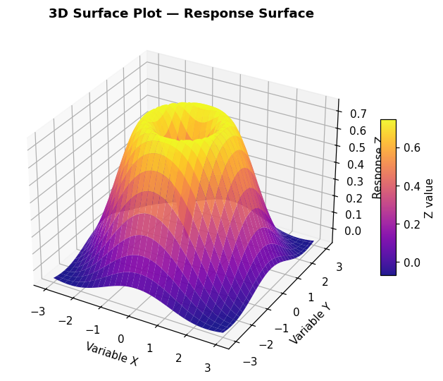

**Python:**
```python
from mpl_toolkits.mplot3d import Axes3D
ax = plt.figure().add_subplot(projection='3d')
ax.plot_surface(X, Y, Z, cmap='plasma')
```

---

#### Network / Graph Diagram

**Use when:** Showing relationships and connectivity — protein interaction networks, ecological food webs, citation networks, neural connectivity.

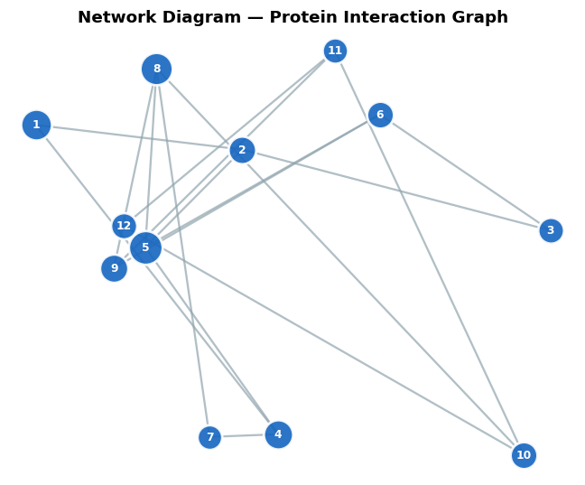

---

#### Regression / Residual Plots

**Use when:** Diagnosing how well a statistical model fits the data — checking for non-linearity, heteroscedasticity, outliers.

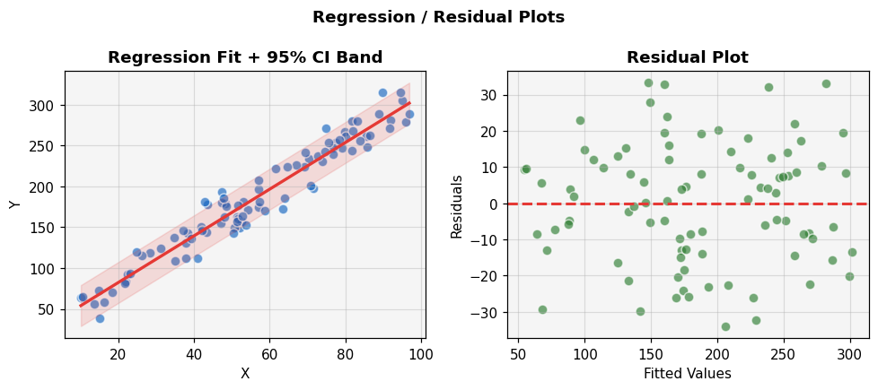

---

### 3.2 Science Visualisation Practice Projects

1. Plot a distribution of experimental measurements with histogram + KDE
2. Compare three experimental groups with a violin plot
3. Generate a correlation heatmap for a multi-variable dataset
4. Produce a scatter matrix for a biological dataset (e.g., Iris, Penguins)
5. Add error bars to a bar chart of group means

---

## Appendix — Quick Reference: Chart Selection Guide

| Goal | Chart Type |
|---|---|
| Show change over time | Line Chart, Area Chart |
| Compare categories | Bar / Column Chart |
| Show part of a whole | Pie, Donut, Treemap, Stacked Bar |
| Show distribution | Histogram, Box Plot, Violin Plot |
| Show relationship | Scatter Plot, Bubble Chart |
| Show flow / process | Funnel Chart, Sankey Diagram |
| Show performance vs. target | Bullet Chart, Gauge |
| Show geography | Choropleth Map |
| Show stock prices | Candlestick Chart |
| Show correlation matrix | Heatmap |
| Show multi-variable comparison | Radar / Spider Chart, Scatter Matrix |
| Show uncertainty | Error Bar Chart, Confidence Bands |

---

## Appendix — Recommended Learning Path

```
Week 1–2:  Part 0 — Foundations (data types, chart decision framework, tool setup)
Week 3–4:  Part 1 — Finance (line, candlestick, waterfall, treemap)
Week 5–6:  Part 2 — Sales & Marketing (bar, funnel, scatter, maps)
Week 7–8:  Part 3 — Science (histogram, box, violin, heatmap, error bars)
Week 9:    Capstone — one project per domain using all three tools
Week 10:   Presentation & critique — students present and defend their charts
```

---

*Sources consulted: [CleanChart — Financial Data Visualization](https://www.cleanchart.app/blog/financial-data-visualization) · [Julius AI — Finance Visualization](https://julius.ai/articles/financial-data-visualization-guide) · [HubSpot — Chart Types Guide](https://blog.hubspot.com/marketing/types-of-graphs-for-data-visualization) · [SR Analytics — Visualization Techniques](https://sranalytics.io/blog/data-visualization-techniques/) · [Yale Library — Data Visualization Types](https://guides.library.yale.edu/datavisualization/types) · [Scientific Discovery — Visualization Guide](https://www.scientificdiscovery.dev/p/salonis-guide-to-data-visualization)*
